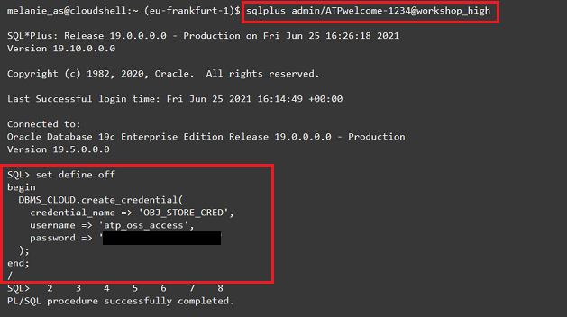
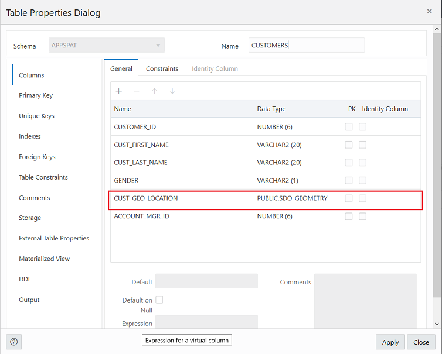
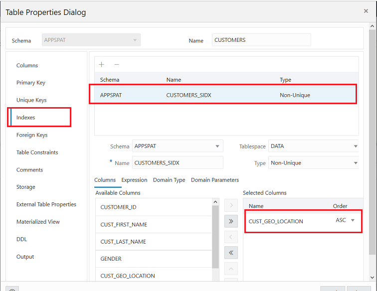
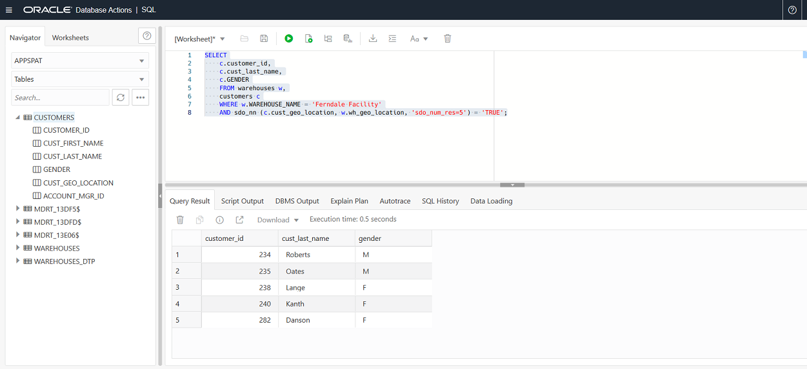
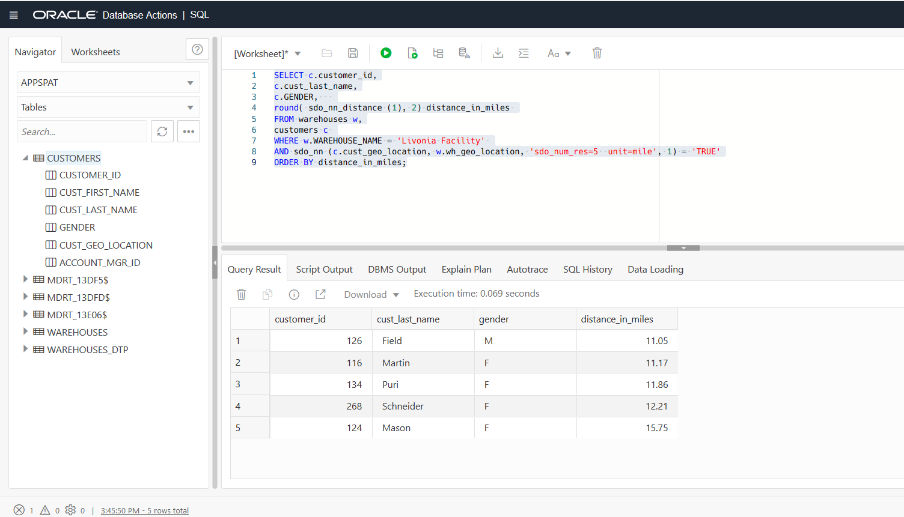
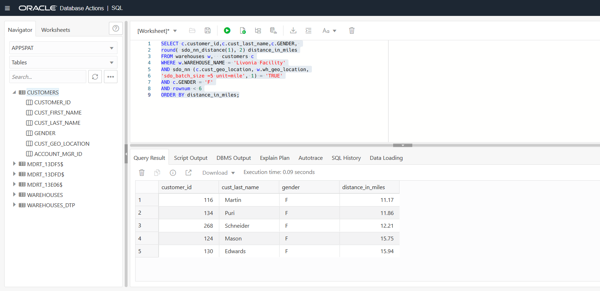
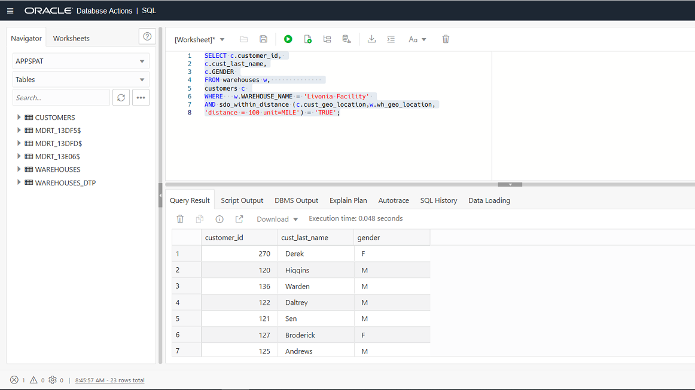
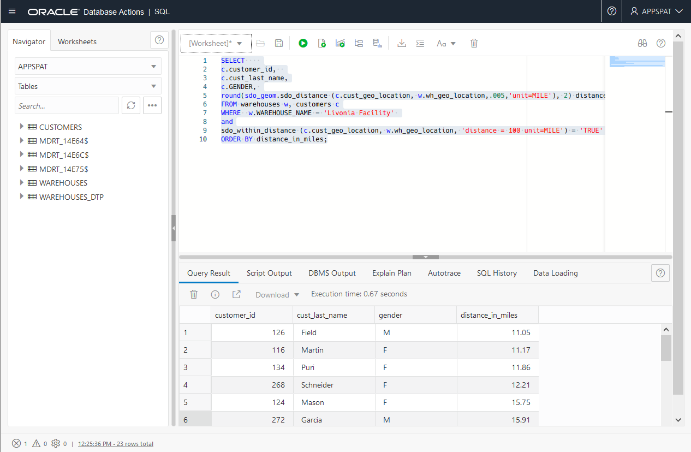
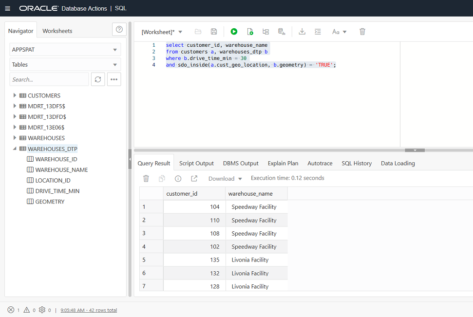

# Oracle Spatial

## Introduction
This lab walks you through the steps of setting up the environment for Spatial lab and then takes you through. You can connect to the Oracle Database instance using any client of your choice. The instructions for this lab, document using SQL Developer Web and sql*plus in Cloud Shell.


### About Oracle Spatial

Oracle Spatial is an integrated set of functions, procedures, data types, and data models that support spatial analytics. The spatial features enable spatial data to be stored, accessed, and analyzed quickly and efficiently in an Oracle database.

Oracle Spatial is designed to make spatial data management easier and more natural to users of location-enabled applications and geographic information system (GIS) applications. Once spatial data is stored in an Oracle database, it can be easily manipulated, retrieved, and related to all other data stored in the database.

A common example of spatial data can be seen in a road map. A road map is a two-dimensional object that contains points, lines, and polygons that can represent cities, roads, and political boundaries such as states or provinces. A road map is a visualization of geographic information.

The data that indicates the Earth location (such as longitude and latitude) of these rendered objects is the spatial data. When the map is rendered, this spatial data is used to project the locations of the objects on a two-dimensional piece of paper.

 [](youtube:Q2jm93Rm95g)

Oracle Spatial consists of the following:
-	Schema (MDSYS)
-	A spatial indexing mechanism  	
-	Operators, functions, and procedures
-	Native data type for vector data called SDO\_GEOMETRY(An Oracle table can contain one or more SDO\_GEOMETRY columns.)


### Scenario
MyCompany has several major warehouses. It needs to locate its customers who are near a given warehouse, to inform them of new advertising promotions. To locate its customers and perform location-based analysis, MyCompany must store location data for both its customers and warehouses.

We will be using three tables – CUSTOMERS, WAREHOUSES and WAREHOUSES\_DTP.

Each table stores location using Oracle's native spatial data type, SDO\_GEOMETRY. A location can be stored as a point in an SDO\_GEOMETRY column of a table. The customer's location is associated with longitude and latitude values on the Earth's surface—for example, -63.13631, 52.485426.

## STEP 1: Prepare your environment

If you have  downloaded the wallet for your database in a previous lab, skip to **Extract the wallet** If you do not have a wallet, follow this process.

### Download the Wallet

Navigate to the *Autonomous Database Details* page for your database. 

Select the **Copy** next to the OCID for your database.


Start Cloud Shell by selecting the icon in the menu bar.


After a few moments, the cloud shell will open at the bottom of your web browser window.

Use your autonomous\_database\_ocid to create the Oracle Wallet. You will be setting the wallet password to the same value as the ADB admin password for ease of use. This is not a recommended practice and just used for the purposes of this lab. You will give the downloaded file the name 'converged-wallet.zip'.


````
cd ~
oci db autonomous-database generate-wallet --password <your admin password> --file converged-wallet.zip --autonomous-database-id <your ocid>
````

  

The wallet file will be downloaded to your cloud shell file system under your home directory.

Enter the list command in your cloudshell below to verify the *converged-wallet.zip* was created

````
ls
````

  

### Extract the wallet

Unzip the contents of the wallet file into a directory that  you will call *wallet*. The directory can be created automatically by  the unzip command.

````
unzip -d wallet converged-wallet.zip
````


Next you need to modify the *sqlnet.ora* file located in the wallet directory to include the location of the wallet contents (.e.g the directory holding your tnsnames.ora)

If you are unsure of the full directory name and path,  you can cut-and-paste this from the output of the *pwd* operation.

````
cd ~/wallet
pwd
````


Edit the contents of the *sqlnet.ora* file

````
vi sqlnet.ora
````

Change the first line in the sqlnet.ora file to use your directory name as it appears in your Oracle Cloud Shell prompt:

*OLD:* `WALLET_LOCATION = (SOURCE = (METHOD = file) (METHOD_DATA = (DIRECTORY="?/network/admin")))`

*NEW:* `WALLET_LOCATION = (SOURCE = (METHOD = file) (METHOD_DATA = (DIRECTORY="/home/<YOUR USERNAME HERE>/wallet")))`

So in the screenshot example, my wallet directory is `/home/melanie_as/wallet` so my entry is `WALLET_LOCATION = (SOURCE = (METHOD = file) (METHOD_DATA = (DIRECTORY="/home/melanie_as/wallet")))` Use your information to complete this change.


Change directory back to your home Directory

````
cd ..
````

## STEP 2: Load the data

In this step you will load the data for the lab using Oracle Data Pump. 

### Storing your object store authentication token credentials in the database

To access data in the Object Storage you must enable your database user to authenticate itself with the Object Storage using your object store account and authentication token.

You do this by creating a private CREDENTIAL object for your user that stores this information encrypted in your Autonomous Database instance. This encrypted connection information is only usable by your user schema. 

In cloud shell, set the TNS_ADMIN environment variable to your wallet directory. The tilde `~` symbol is a shortcut for your home directory path. 

```
export TNS_ADMIN=~/wallet
```


Connect using SQL*Plus command line from your cloud shell prompt

```
sqlplus admin/<your admin password>@<your dbname>_high
```


Now execute the script to create a credential. Copy and paste the contents of the  script file  [atp_create_credential.sql](../common-source/atp_create_credential.sql). You only need to create the credential once during the lab. If you receive the error `ORA-20022: Credential "ADMIN"."OBJ_STORE_CRED" already exists` then you have already created this credential as part of a previous lab. 

**Do not copy and paste the example script below.**

```
set define off
begin
DBMS_CLOUD.create_credential(
credential_name => 'OBJ_STORE_CRED',
username => 'atp_oss_access',
password => '<PASSWORD HERE>'
);
end;
/
```



Prepare the destination schema for your imported data. In SQL*Plus execute the following commands

```
create user appspat identified by OracleLab1234;
grant dwrole to appspat;
alter user appspat quota unlimited on data;
BEGIN
      ORDS_ADMIN.ENABLE_SCHEMA(
        p_enabled => TRUE,
        p_schema => 'appspat',
        p_url_mapping_type => 'BASE_PATH',
        p_url_mapping_pattern => 'appspat',
        p_auto_rest_auth => TRUE
      );
      COMMIT;
    END;
    /
```

You have verified that your wallet has been correctly configured by using SQL*Plus and have created a credential to access the object storage bucket. You have prepared the destination schema, granting it the DWROLE, unlimited quota on the data tablespace, and enabled the schema for SQL Developer Web by enabling ORDS.

Now you are ready to load data from Object Store as the admin user.

Quit SQL*PLUS.

In Cloud Shell execute the following command to import the data, replacing the password and database name with values from your environment.

```
impdp admin/<your password>@<your DB>_high \
credential=obj_store_cred  \
dumpfile=https://objectstorage.eu-frankfurt-1.oraclecloud.com/n/oractdemeabdmautodb/b/DEMO_DATA/o/export_spatial22Sep2020.dmp \
directory=data_pump_dir
```


The import should take less than a minute to run. 2 errors are expected in the output `ORA-31684: Object type USER:"APPSPAT" already exists` and `ORA-39083: Object type ROLE_GRANT failed to create with error: ORA-01924: role 'DBA' not granted or does not exist`


## STEP 3: Connect to SQL Developer Web
In the previous step you executed commands to grant the appspat user privileges and setup SQL Developer Web using Rest Services (ORDS). 

Open *Database Actions* from your Database Details screen.


Enter the username `appspat` and select **Next.**


Enter the password for appspat `OracleLab1234` and sign in.


Under the *Development* region of the Database Actions page select the **SQL** tile.


## STEP 4: Examining your Spatial data

As part of the dataload you created the tables CUSTOMERS,WAREHOUSES_DTP and WAREHOUSES.

Examine one of these tables using SQL Developer Web.

Select the *Customers* table in the list of tables, and right click, and select **Edit**


This opens the *Table Properties* window.

You can see that the customer table has a column CUST_GEO_LOCATION which is of the special SDO_GEOMETRY data type to store the spatial data.




Before the spatial index was created in the original data load, entries were inserted into the USER_SDO_GEOM_METADATA view to provide information about  dimensions associated with the data.

`insert into user_sdo_geom_metadata
(TABLE_NAME,
     COLUMN_NAME,
     DIMINFO,
     SRID)
  VALUES (
'CUSTOMERS','CUST_GEO_LOCATION',
MDSYS.SDO_DIM_ARRAY(MDSYS.SDO_DIM_ELEMENT('X', -180, 180, 0.05),
               MDSYS.SDO_DIM_ELEMENT('Y', -90, 90, 0.05)),
4326);`

**Here is a description of the items that were entered:**

  -	TABLE-NAME: Name of the table which contains the spatial data.
  -	COLUMN-NAME: Name of the SDO-GEOMETRY column which stores the spatial data.
  -	MDSYS.SDO-DIM-ARRAY: Constructor which holds the MDSYS.SDO-DIM-ELEMENT object,which in turn stores the extents of the spatial data  in each dimension (-180.0, 180.0), and a tolerance value (0.05). The tolerance is a round-off error value used by Oracle Spatial, and is in meters for longitude and latitude data. In this example, the tolerance is 5 mm.
  -	4326: Spatial reference system id (SRID): a foreign key to an Oracle dictionary table  (MDSYS.CS-SRS) that contains all the supported coordinate systems. It is important to associate your customer's location to a coordinate system. In this example, 4326 corresponds to "Longitude / Latitude (WGS 84).".


Select the *Indexes* item in the sidebar.

You can see that there has been an index created called  *CUSTOMERS_SIDX* .This index is on the CUSTOMER_SDO column. 



This type of index on spatial data was created using a command similar to `CREATE INDEX customers_sidx ON customers(CUST_GEO_LOCATION) indextype is mdsys.spatial_index;`


Select **Close** to leave table properties without making any changes.

## **STEP 5**: Run Spatial Queries

#### Query #1: Find the five customers closest to the warehouse whose warehouse name  is 'Ferndale Facility'

-	The SDO\_NN (**N**earest **N**eighbour) operator returns the SDO_NUM\_RES (number of results) value of the customers from the CUSTOMERS table who are closest to warehouse 3. The first argument to SDO\_NN (c.cust-geo-location this lab ) is the column to search. The second argument to SDO\_NN (w.wh\_geo\_location in this lab) is the location you want to find the neighbors nearest to. No assumptions should be made about the order of the returned results. For example, the first row returned is not guaranteed to be the customer closest to warehouse 3. If two or more customers are an equal distance from the warehouse, then either of the customers may be returned on subsequent calls to SDO\_NN.

- When using the SDO\_NUM\_RES parameter (limiting the number of results returned) ,  other constraints should be used cautiously in the WHERE clause. SDO\_NUM\_RES takes only proximity into account. For example, if you added a criterion to the WHERE clause because you wanted the five closest female customers, and four of the five closest customers are male, the query above would return one row. This behavior is specific to the SDO-NUM-RES parameter, and its results may not be what you are looking for. You will learn how to find the five closest female customers in the discussion of query 3.


    SELECT
        c.customer_id,
        c.cust_last_name,
        c.GENDER
        FROM warehouses w,
        customers c
        WHERE w.WAREHOUSE_NAME = 'Ferndale Facility'
        AND sdo_nn (c.cust_geo_location, w.wh_geo_location, 'sdo_num_res=5') = 'TRUE';




#### Query #2: Find the five customers closest to warehouse named 'Livonia Facility' and put the results in order of distance

In this query you are not just looking for the Nearest Neighbour of your warehouse, but also calculating the distance. 

- The SDO\_NN\_DISTANCE operator is an ancillary operator to the SDO\_NN operator; it can only be used within the SDO\_NN operator and not on its own. The argument for this operator is a number that matches the number specified as the last argument of SDO_NN; in this example it is 1. There is no hidden meaning to this argument, it is simply a tag. If SDO\_NN\_DISTANCE() is specified, you can order the results by distance and guarantee that the first row returned is the closest. If the data you are querying is stored as longitude and latitude, the default unit for SDO\_NN\_DISTANCE is meters.
- The SDO_NN operator also has a UNIT parameter that determines the unit of measure returned by SDO\_NN\_DISTANCE.
- The ORDER BY DISTANCE clause ensures that the distances are returned in order, with the shortest distance first.

    ```
    SELECT c.customer_id,
    c.cust_last_name,
    c.GENDER,   
    round( sdo_nn_distance (1), 2) distance_in_miles 
    FROM warehouses w,
    customers c 
    WHERE w.WAREHOUSE_NAME = 'Livonia Facility' 
    AND sdo_nn (c.cust_geo_location, w.wh_geo_location, 'sdo_num_res=5  unit=mile', 1) = 'TRUE'
    ORDER BY distance_in_miles;
    ```
    
    

#### Query #3: Find the five female customers closest to warehouse named 'Livonia Facility', put the results in order of distance, and give the distance in miles


- SDO\_BATCH\_SIZE is a tunable parameter that may affect your query's performance. If you do not set it, or set it to '0' then then it will calculate a batch size that is suitable for the result set size. However, the calculated batch size may not be optimal, and the calculation incurs some processing overhead. SDO\_NN internally calculates SDO_BATCH_SIZE  number of distances at a time. The initial batch of rows returned may not satisfy the constraints in the WHERE clause, so the number of rows specified by SDO\_BATCH\_SIZE is continuously returned until all the constraints in the WHERE clause are satisfied. You should choose a SDO\_BATCH\_SIZE that initially returns the number of rows likely to satisfy the constraints in your WHERE clause.
- The UNIT parameter used within the SDO_NN operator specifies the unit of measure of the SDO\_NN\_DISTANCE parameter. The default unit is the unit of measure associated with the data. For longitude and latitude data, the default is meters. The possible values for the UNIT parameter are documented in the table MDSYS.SDO_DIST_UNITS
- c.gender = 'F' and rownum < 6 are the additional constraints in the WHERE clause to limit the results to people who are female,  and the  rownum < 6 clause is necessary to limit the number of results returned to fewer than 6. 
- The ORDER BY DISTANCE\_IN\_MILES clause ensures that the distances are returned in order, with the shortest distance first and the distances measured in miles.

    ```
    SELECT c.customer_id,c.cust_last_name,c.GENDER, 
    round( sdo_nn_distance(1), 2) distance_in_miles
    FROM warehouses w,   customers c
    WHERE w.WAREHOUSE_NAME = 'Livonia Facility'
    AND sdo_nn (c.cust_geo_location, w.wh_geo_location,
    'sdo_batch_size =5 unit=mile', 1) = 'TRUE'
    AND c.GENDER = 'F'
    AND rownum < 6
    ORDER BY distance_in_miles;
    ```




#### Query #4: Find all the customers within 100 miles of warehouse named 'Livonia Facility'

- The SDO\_WITHIN\_DISTANCE operator returns the customers from the customers table that are within 100 miles of warehouse 'Livonia Facility'. The first argument to SDO\_WITHIN\_DISTANCE (c.cust\_geo\_location) is the column to search. The second argument to SDO\_WITHIN\_DISTANCE (w.wh\_geo\_location)i s the location you want to determine the distances from. No assumptions should be made about the order of the returned results. For example, the first row returned is not guaranteed to be the customer closest to warehouse .
- The DISTANCE parameter used within the SDO\_WITHIN\_DISTANCE operator specifies the distance value; in this example it is 100.
- The UNIT parameter used within the SDO\_WITHIN\_DISTANCE operator specifies the unit of measure of the DISTANCE parameter. The default unit is the unit of measure associated with the data. For longitude and latitude data, the default is meters; so in this lab you need to  specify the unit=miles .

    ```
    SELECT c.customer_id, 
    c.cust_last_name,
    c.GENDER 
    FROM warehouses w,              
    customers c 
    WHERE   w.WAREHOUSE_NAME = 'Livonia Facility' 
    AND sdo_within_distance (c.cust_geo_location,w.wh_geo_location,
    'distance = 100 unit=MILE') = 'TRUE';
    ```




#### Query #5: Find all the customers within 100 miles of warehouse named 'Livonia Facility', put the results in order of distance, and give the distance in miles.

- The SDO\_GEOM.SDO\_DISTANCE function computes the exact distance between the customer's location and 'Livonia Facility'. The first argument to SDO\_GEOM.SDO\_DISTANCE (c.cust\_geo\_location) contains the customer's location whose distance from 'Livonia Facility' is to be computed. The second argument to SDO\_WITHIN\_DISTANCE (w.wh\_geo\_location) is the location of warehouse 'Livonia Facility', whose distance from the customer's location is to be computed.
- The third argument to SDO\_GEOM.SDO\_DISTANCE (0.005) is the tolerance value. The tolerance is a round-off error value used by Oracle Spatial. The tolerance is in meters for longitude and latitude data. In this example, the tolerance is 5 mm.
- The UNIT parameter used within the SDO\_GEOM.SDO\_DISTANCE parameter specifies the unit of measure of the distance computed by the SDO\_GEOM.SDO\_DISTANCE function. The default unit is the unit of measure associated with the data. For longitude and latitude data, the default is meters. In this example you are specifying miles.
- The ORDER BY DISTANCE\_IN\_MILES clause ensures that the distances are returned in order, with the shortest distance first and the distances measured in miles.

    ```
    SELECT    
    c.customer_id,  
    c.cust_last_name,
    c.GENDER, 
    round(sdo_geom.sdo_distance (c.cust_geo_location, w.wh_geo_location,.005,'unit=MILE'), 2) distance_in_miles
    FROM warehouses w, customers c
    WHERE  w.WAREHOUSE_NAME = 'Livonia Facility' 
    and
    sdo_within_distance (c.cust_geo_location, w.wh_geo_location, 'distance = 100 unit=MILE') = 'TRUE'
    ORDER BY distance_in_miles;
    
    ```




#### Query #6: Find all the customers inside a 30 min drive time polygons  

- Drive Time polygons are simply the areas reachable from a location within an amount of time. They are used for things like placing new stores or office locations; i.e. locate a new office so that all our employees can reach our office within a given drive time. Or locate a new store with a drive time polygon containing new target customers and not cannibalizing another store location. The table WAREHOUSES_DTP has been populated with information for each warehouse, and the area that is within 30 minutes drive.

- The SDO\_INSIDE  function returns 'TRUE'  if the the first argument  (a.cust_geo_location - where the customer is located ) is INSIDE the  geometry represented by the second parameter (b. geometry - the area that is within 30 minutes drive time of that warehouse) . 

  ```
  select customer_id, warehouse_name
  from customers a, warehouses_dtp b
  where b.drive_time_min = 30
  and sdo_inside(a.cust_geo_location, b.geometry) = 'TRUE';
  ```




## Learn More

During this lab you have learned how to query SPATIAL data in the Oracle Autonomous Database.  For more information see the Oracle Documentation on [SPATIAL](https://docs.oracle.com/en/database/oracle/oracle-database/19/spatial-and-graph.html).


## Acknowledgements

* **Authors** - Balasubramanian Ramamoorthy, Arvind Bhope
* **Last Updated By/Date** - Melanie Ashworth-March, Rob Watson - June 2021

