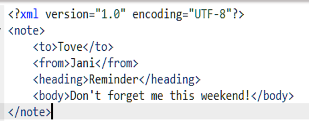
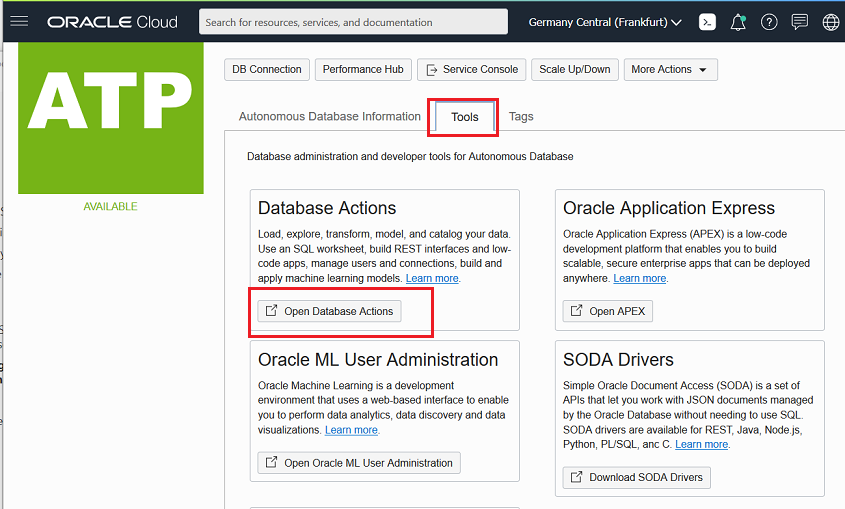
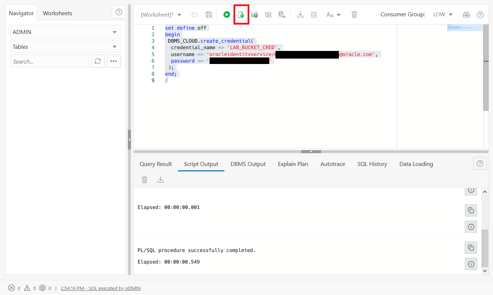
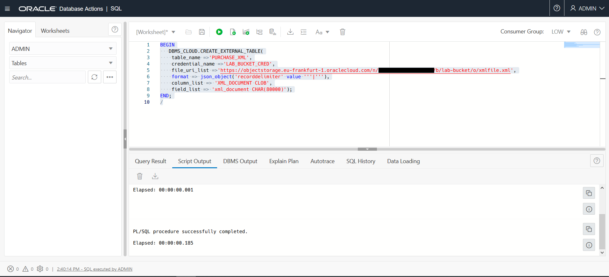

# Oracle XML and Autonomous Database

## Introduction
There are several steps within this lab.
-  Configure the environment  for the XML lab .
-  Query XML Data: XQuery is a very general and expressive language, and SQL/XML functions XMLQuery, XMLTable, XMLExists, and XMLCast combine that power of expression and computation with the strengths of SQL. We can query XMLType data, possibly decomposing the resulting XML into relational data using function XMLTable.
-  Insert and Update XML Data -  You can update XML content or replace either the entire contents of a document or only particular parts of a document. The ability to perform partial updates on XML documents is very powerful, particularly when we make small changes to large documents, as it can significantly reduce the amount of network traffic and disk input-output required to perform the update. The Oracle UPDATEXML function allows us to update XML content stored in Oracle Database.


### About Oracle XML

XML (Extensible Markup Language) is used to store and transport data. XML data is known as self-describing or self-defining, meaning that the structure of the data is embedded with the data, thus when the data arrives there is no need to pre-build the structure to store the data; it is dynamically understood within the XML.

The basic building block of an XML document is an element, defined by tags. An element has a beginning and an ending tag. All elements in an XML document are contained in an outermost element known as the root element. XML can also support nested elements, or elements within elements. This ability allows XML to support hierarchical structures. Element names describe the content of the element, and the structure describes the relationship between the elements.

For example, XML documents can be very simple, such as the following:

 

### XML with Oracle Database

Oracle XML DB is a high-performance, native XML storage and retrieval technology that is delivered as a part of all versions of Oracle Database.

Oracle XML DB also supports the SQL/XML standard, which allows SQL-centric development techniques to be used to publish XML directly from relational data stored in Oracle Database.XML is an extremely popular way to persist and exchange business critical information.

 [](youtube:lGQvxPCYR2c)

Oracle XML DB allows an organization to manage XML content in the same way that ii manages traditional relational data. This allows organizations to save costs and improve return on investment by using a single platform to manage and secure all of their mission critical data. Oracle XML DB was first released with Oracle 9iR2, and it has been enhanced in each subsequent major release of the database.

There are some limitations on the usage of XML in Autonomous Database. See the documentation [here](https://docs.oracle.com/en/cloud/paas/autonomous-database/atpdg/experienced-database-users.html)

## Step 1: Start SQL Developer Web


Open *Database Actions* from your Database Details screen.




Enter the username `admin` and select **Next.**


Enter the password for admin  and select **Sign In**.


Under the *Development* region of the Database Actions page select the **SQL** tile.


## **Step 2:** Prepare your instance to access object storage


### Information about how the environment was prepared

To load data from the Oracle Cloud Infrastructure Object Storage you will need a Cloud user with the appropriate privileges to read data from the Object Store. A user \'*atp_oss_access*\' with the correct setup and authentication token has been pre-created for you to use in the next step. 


### Storing your object store authentication token credentials in the database

To access data in the Object Storage you must enable your database user to authenticate itself with the Object Storage using your object store account and authentication token.

You do this by creating a private CREDENTIAL object for your user that stores this information encrypted in your Autonomous Database instance. This encrypted connection information is only usable by your user schema.

Within the SQL worksheet of SQL Developer in your **admin_high** connection, execute the following code to store the object store credential in the database:

The correct sql can be found in the file [atp_create_credential.sql](../common-source/atp_create_credential.sql). You only need to create the credential once per user during the lab. If you receive the error `ORA-20022: Credential "ADMIN"."OBJ_STORE_CRED" already exists` then you have already created this credential as part of a previous lab. 

**Do not copy and paste the below example script.**

```
set define off
begin
DBMS_CLOUD.create_credential(
credential_name => 'OBJ_STORE_CRED',
username => 'atp_oss_access',
password => '<PASSWORD HERE>'
);
end;
/
```



Now you are ready to load data from Object Store as the admin user.


## Step 3: Create an External Table on the file.

To create an external table using a file stored in Object Storage you will use the DBMS_CLOUD.CREATE_EXTERNAL_TABLE procedure.


```
BEGIN
   DBMS_CLOUD.CREATE_EXTERNAL_TABLE(
    table_name =>'PURCHASE_XML',
    credential_name =>'OBJ_STORE_CRED',
    file_uri_list =>'https://objectstorage.eu-frankfurt-1.oraclecloud.com/n/oractdemeabdmautodb/b/DEMO_DATA/o/converged%2Fxmlfile.xml',
    format => json_object('recorddelimiter' value '''|'''),
    column_list => 'XML_DOCUMENT CLOB',
    field_list => 'xml_document CHAR(80000)');
END;
/
```

The parameters you are providing are as follows

- table_name: This will be the new table's name
- credential_name: This is the credential that has access to the Object Storage location.
- file_uri_list: This is the file location. It can be specified in several formats see the [documentation](.https://docs.oracle.com/en/cloud/paas/autonomous-database/adbsa/file-uri-formats.html) for details.
- format: This describes the format for the data in the file. In this example you are specifying a recorddelimiter, but you could also specify reject limits and other information depending on the format of your file. See the [documentation](https://docs.oracle.com/en/cloud/paas/autonomous-database/adbsa/format-options.html) for more details on the available formats.
- column_list: A comma-delimited list of column names and data types for the external table.



## Task 3:  Create a table from the External Table 

 You  can now immediately query our XML file lying in the object store via the external table CLOB column, using [native database XML features](https://docs.oracle.com/en/database/oracle/oracle-database/19/adxdb/how-to-use-XML-DB.html#GUID-D937B3D1-BA54-41D0-9428-4739DA805D75) such as XPATH expressions.

```
SELECT EXTRACTVALUE(XMLTYPE(xml_document),'/PurchaseOrder/Actions/Action/User') as Users from PURCHASE_XML;
```


Use your external table to populate a table in the database.

```
CREATE TABLE XPURCHASE (xml_document xmltype); 
INSERT INTO XPURCHASE (SELECT XMLTYPE(xml_document) from PURCHASE_XML);
```


## Task 4: Insert XML record.

Let's take a count of the rows we have currently and then do a insert. The source external table had 1 row.

```
SELECT Count(*) FROM  xpurchase p;
```
Use your  following sql to add a new row to the table.

```
Insert into xpurchase values ('<PurchaseOrder>
  <PONumber>10001</PONumber>
  <Reference>MSD-20200505</Reference>
  <Requestor>MS Dhoni</Requestor>
  <User> TGATES </User>
  <CostCenter>A50</CostCenter>
  <ShippingInstructions>
    <name>MS Dhoni</name>
    <Address>
      <street>200 Sporting Green</street>
      <city>South San Francisco</city>
      <state>CA</state>
      <zipCode>99236</zipCode>
      <country>United States of America</country>
    </Address>
    <Phone>
      <type>Office</type>
      <number>131-555-5589</number>
    </Phone>
  </ShippingInstructions>
  <LineItems>
    <ItemNumber>1</ItemNumber>
    <Part>
      <Description>Ivanhoe</Description>
      <UnitPrice>19.95</UnitPrice>
      <UPCCode>66479101648</UPCCode>
    </Part>
    <Quantity>2</Quantity>
  </LineItems>
  <LineItems>
    <ItemNumber>2</ItemNumber>
    <Part>
      <Description>Karaoke: Classic Country Hits Vol. 3 203</Description>
      <UnitPrice>19.95</UnitPrice>
      <UPCCode>13023003897</UPCCode>
    </Part>
    <Quantity>2</Quantity>
  </LineItems>
  <LineItems>
    <ItemNumber>3</ItemNumber>
    <Part>
      <Description>Urban Legend</Description>
      <UnitPrice>19.95</UnitPrice>
      <UPCCode>43396030916</UPCCode>
    </Part>
    <Quantity>9</Quantity>
  </LineItems>
  <Special_Instructions>COD</Special_Instructions>
</PurchaseOrder>
');
commit;
```


```
 SELECT Count(*) FROM  xpurchase p;
```


This should return 1 more row !


## Task 5: Update values in the XML table

You can update values in your XML data. 

Review which user is responsible for the the Purchase Order with the Reference 'MSD-20200505'


```
SELECT extractValue(xml_document, '/PurchaseOrder/User') 
FROM xpurchase where existsNode(xml_document, '/PurchaseOrder[Reference="MSD-20200505"]') =1;
```


Update the User to 'M March'

```
UPDATE xpurchase
set xml_document=updateXML(XML_DOCUMENT, '/PurchaseOrder/User/text()', 'M March')
WHERE existsNode(XML_DOCUMENT, '/PurchaseOrder[Reference="MSD-20200505"]')=1;
commit;
```


Verify that the update was successful.

```
SELECT extractValue(xml_document, '/PurchaseOrder/User') 
FROM xpurchase where existsNode(xml_document, '/PurchaseOrder[Reference="MSD-20200505"]') =1;
```


## Task 6: Example Queries


Get the list of the customer and their purchase information from a specific geographical location.  
**XMLEXISTS** is an SQL/XML operator that you can use to query XML values in SQL, in a regular query. You can use the xmlexists function to look to see if a specific value is present in an xmltype column.

```
SELECT xp.xml_document.getclobval() FROM   xpurchase xp
WHERE xmlexists('/PurchaseOrder/ShippingInstructions/Address[city/text()=$CITY]' passing xml_document, 'South San Francisco' AS "CITY" );
```


Get the product description for products whose unit prices matches $19.95. **XMLSERIALIZE** is a SQL/XML operator that you can use to convert an XML type to a character type.


```
  SELECT XMLSERIALIZE(CONTENT COLUMN_VALUE AS CLOB INDENT SIZE=2)
  FROM  xpurchase xp,
    XMLTable(
      '<Summary>;
       {
        for $r in /PurchaseOrder/LineItems/Part
        return $r/Description
       }
       </Summary>'
       passing xml_document
    )
    WHERE xmlexists('/PurchaseOrder/LineItems/Part[UnitPrice/text()=$UnitPrice]' passing xml_document, '19.95' AS "UnitPrice" );
```


**XMLQUERY** allows you to query XML data in SQL statements. It takes an XQuery expression as a string literal, an optional context item, and other bind variables and returns the result of evaluating the XQuery expression using these input values. The XQuery string is a complete XQuery expression, including prolog (a series of declarations and definitions that together create the required environment for query processing.) For more information about XQuery see the standard [here](https://www.w3.org/TR/xquery/).

```
SELECT xmlquery(
      '<POSummary lineItemCount="{count($XML/PurchaseOrder/LineItems/ItemNumber)}">;{
         $XML/PurchaseOrder/User,
         $XML/PurchaseOrder/Requestor,
         $XML/PurchaseOrder/LineItems/LineItem[2]
       }
       </POSummary>'
      passing xml_document AS "XML"
      returning content
    ).getclobval() initial_state
    FROM  xpurchase
    WHERE xmlExists(
      '$XML/PurchaseOrder[CostCenter=$CS]'
       passing xml_document AS "XML",
      'R20' AS "CS"      )
```


Find the purchase order reference if the Special Instructions for the order are 'COD' (Cash on Delivery) . **ExistsNode**  checks if  the xpath-expression returns at least one XML element or text node. If so, `existsNode` returns 1, otherwise, it returns 0. `existsNode` should only be used in the where clause of the select statement.


```sql
 SELECT extractValue(XML_DOCUMENT, '/PurchaseOrder/Reference') "REFERENCE"
 FROM xpurchase WHERE existsNode(XML_DOCUMENT, '/PurchaseOrder[Special_Instructions="COD"]')=1;
```


**This concludes this lab. **

## Learn More
- [XML](https://docs.oracle.com/en/database/oracle/oracle-database/19/adxdb/index.html)


## Acknowledgements
* **Authors** - Balasubramanian Ramamoorthy, Arvind Bhope, Melanie Ashworth-March
* **Last Updated By/Date** - Melanie Ashworth-March / June 2021

