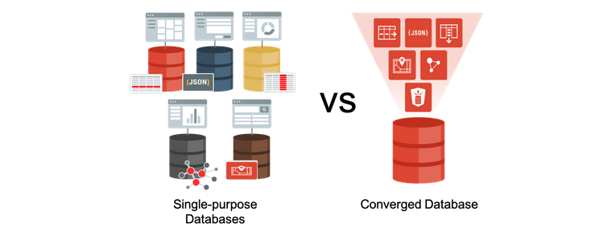

# Converged Functionality of Oracle Autonomous Database Workshop 

## About Oracle's Converged Database

The Oracle Database converges support for multiple data models and  workloads into a single database, while supporting popular development  tools and techniques like events and REST interfaces. As opposed to  using multiple single purpose databases for each data type, using a  converged database results in a **unified data tier**, enabling real-time analytics and machine learning on production data.

**Estimated Workshop Time**: 2 hours.

You don't need to manage and maintain multiple systems or worry about  having to provide unified security across them. To learn more, see this [blog](https://blogs.oracle.com/database/many-single-purpose-databases-versus-a-converged-database).

## Objectives

In this workshop, you will gain first-hand experience of using data types beyond relational data - JSON, SODA, Spatial and XML. 