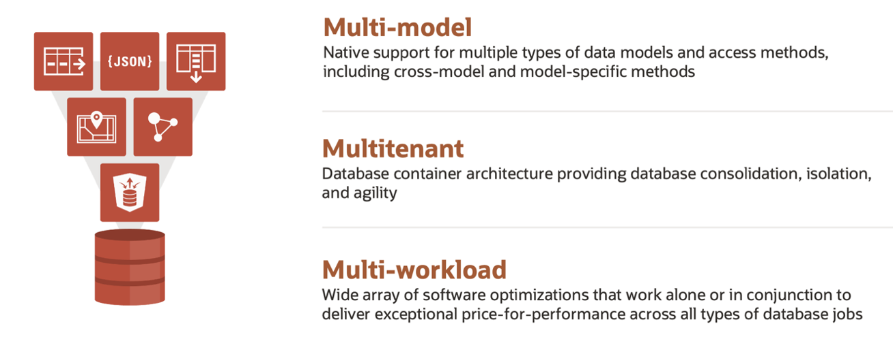

# Introduction

A converged database is a database that has **native support for all modern data types and the latest development paradigms** built into one product.

A converged database is a **multi-model**, **multitenant**, **multi-workload** database. It supports the multiple data types and access methods each development team wants, without unneeded functionality getting in the way. It provides both the consolidation and isolation that dev teams want but don’t want to think about. And it excels in all types of workloads (like OLTP, analytics, and IoT) these teams require. Oracle Database 19c is the world’s first converged database. The rest of the versions since 19c supports the converged capabilities.

Converged databases support **Spatial** data for location awareness, **JSON** for document stores, **IoT** for device integration, **In-memory** technologies for real-time analytics, and of course, traditional **Relational data**. 

By providing support for all of these data types, a Converged Database can run all sorts of workloads from IoT to Blockchain to Analytics and Machine Learning. It can also handle any development paradigm, including Microservices, Events, REST, SaaS, and CI/CD, to name a few.

**Oracle Autonomous Database** is an excellent example of a converged database, as it provides support for Machine Learning, Blockchain, Graph, Spatial, JSON, REST, Events, Editions, and IoT Streaming as part of the core database at no additional cost. It allows you to support many diverse projects using a single platform, significantly reducing complexity and management overhead, while minimizing risk.

**Estimated Lab Time**: 2 hours.

## Objectives

We will cover the following labs during this workshop:

- Lab: Getting Started on the Cloud
- Lab: Provisioning Autonomous Database
- Lab: Prepare the data
- Lab: JSON
- Lab: SODA
- Lab: Spatial
- Lab: XML

You will also use Oracle SQL Developer Web to help execute the programs associated with the lab.

## Prerequisites

An Oracle Cloud Account with credits.

_At this point, you are ready to start learning! Please proceed._

## **Acknowledgements**

- **Author** - Melanie Ashworth-March, Oracle Solution Center
- **Contributor** - Priscila Iruela, Victor Martin