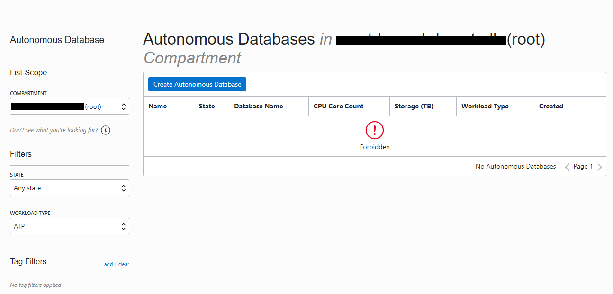

# Introduction

A converged database is a database that has **native support for all modern data types and the latest development paradigms** built into one product.

A converged database is a multi-model, multitenant, multi-workload database. It supports the multiple data types and access methods each development team wants, without unneeded functionality getting in the way. It provides both the consolidation and isolation that dev teams want but don’t want to think about. And it excels in all types of workloads (like OLTP, analytics, and IoT) these teams require. Oracle Database 19c is the world’s first converged database. The rest of the versions since 19c supports the converged capabilities.

Converged databases support Spatial data for location awareness, JSON for document stores, IoT for device integration, in-memory technologies for real-time analytics, and of course, traditional relational data. By providing support for all of these data types, a Converged Database can run all sorts of workloads from IoT to Blockchain to Analytics and Machine Learning. It can also handle any development paradigm, including Microservices, Events, REST, SaaS, and CI/CD, to name a few.

**Oracle Autonomous Database** is an excellent example of a converged database, as it provides support for Machine Learning, Blockchain, Graph, Spatial, JSON, REST, Events, Editions, and IoT Streaming as part of the core database at no additional cost. It allows you to support many diverse projects using a single platform, significantly reducing complexity and management overhead, while minimizing risk.

## About this Workshop

This step takes you through the process of connecting to Oracle Cloud and locating your database.

_Estimated Lab Time:_ XX minutes

## Step 1. Connecting to the Oracle Cloud

**Objectives:**

- Learn how to login to the Oracle Cloud Console

  
### Signing in to the OCI Console

Start your web browser. 

Go to the [OCI console](https://console.eu-frankfurt-1.oraclecloud.com). <https://console.eu-frankfurt-1.oraclecloud.com> For this lab we are using the Frankfurt region, even though other regions may be geographically closer as this is where our tenancy has capacity to support the workshop.

Enter the tenancy name `oractdemeabdmautodb` and click **Continue**

Expand the *Oracle Cloud Infrastructure Direct Sign-In* region by selecting the down arrow

In the *Oracle Cloud Infrastructure Direct Sign-In* region enter the Oracle Cloud Infrastructure login and password you were supplied for this workshop.

Verify that your region is set to Germany Central (Frankfurt) on the top right-hand side of your screen, if not, use the drop down list to select 'Germany Central (Frankfurt)'

### Locating your ADB Instance

As part of the preparation for this lab, ADB instances have been pre-created. 

Select the 'hamburger menu' in the top left hand side, select *Oracle Database* and navigate to
"**Autonomous Transaction Processing"** or "**Autonomous Data Warehouse**" depending on the instructions provided by your lab leader.

This will take you to the management console page for ADB  in the root compartment of the tenancy. The red warning icon \"**Forbidden**\" indicates that the Policies within the tenancy does not allow your user to view ATP Instances in the root compartment.

To locate your ADB instance in this tenancy you need to select a compartment.

Click on the pulldown menu marked **Compartment**. Expand the menu under by using '+'.**Your instructor will tell you which sub compartment to use**.

> Note - Your list of compartments may be different to the one shown above. In this introduction  we will use the compartment called ATP_Delegate in all the screenshots/ examples, with a database workload of Autonomous Transaction Processing. **Your compartment may be different, and your database workload may be different.**

The main page will now change to show the list of Autonomous instances within your compartment, as shown below:

> Note - this lab uses the same tenancy and compartment for all lab attendees. You will see ADB instances listed on this page which have already been provisioned in preparation for this lab.

> Note: the list of instances is sorted by provisioning date, not by name.
> Refer to your lab information sheet to check which ADB instance has been assigned to you for this lab.

Click on the name of your ADB instance from the list of instances. You may have to scroll down to locate it in the list.

This will display more information about your instance and you should notice the various menu buttons that help you manage your new instance

A summary of your instance lifecycle status is shown in the large box on the left. It should be green, with the word '**AVAILABLE**'.

|  |  |
| --------------------------------------- | --------------------------------------- |

_At this point, you are ready to start learning! Please proceed._

## **Acknowledgements**

- **Author** - Melanie Ashworth-March, Oracle Solution Center
- **Contributor** - Priscila Iruela, Victor Martin
