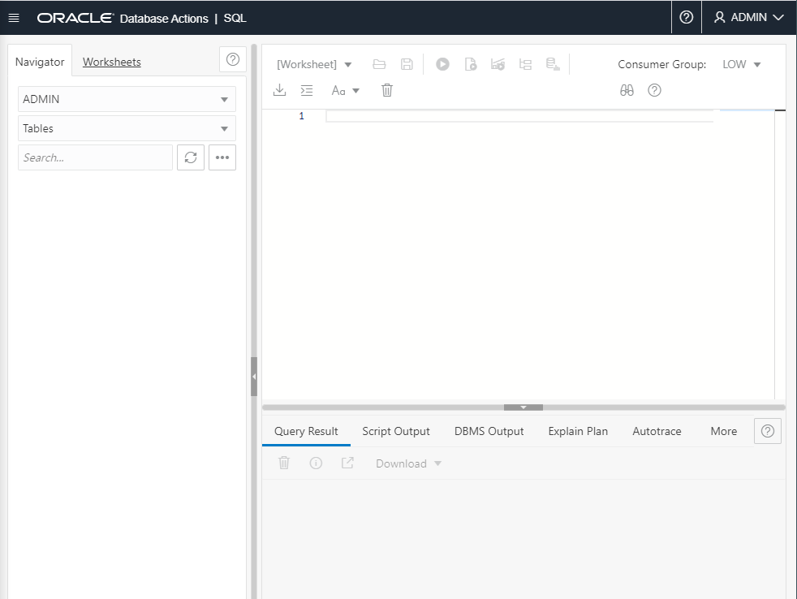
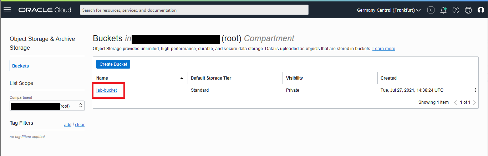
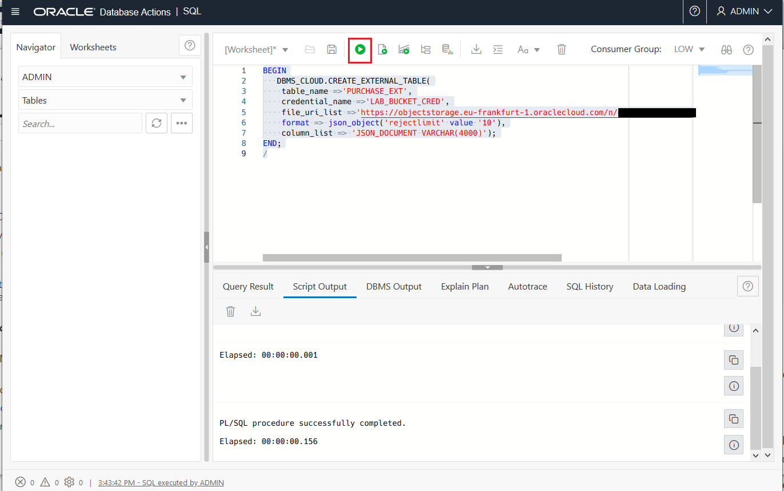
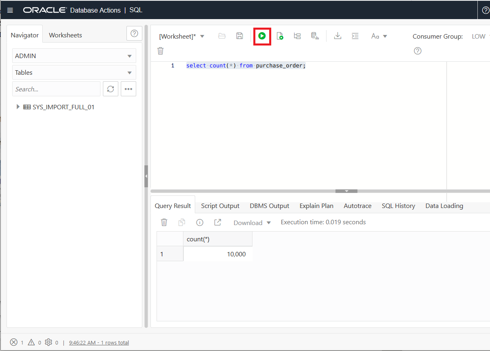
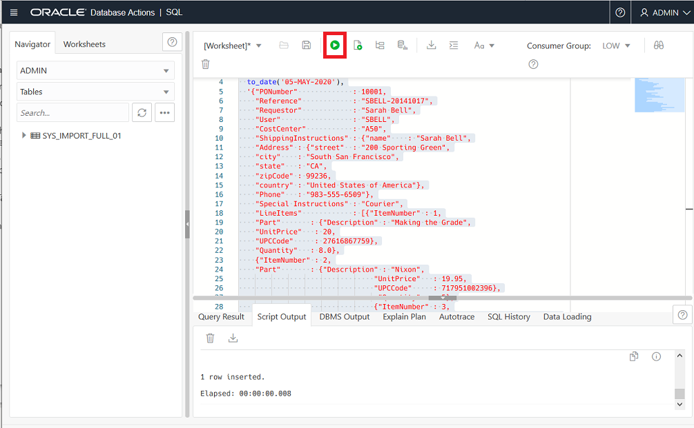
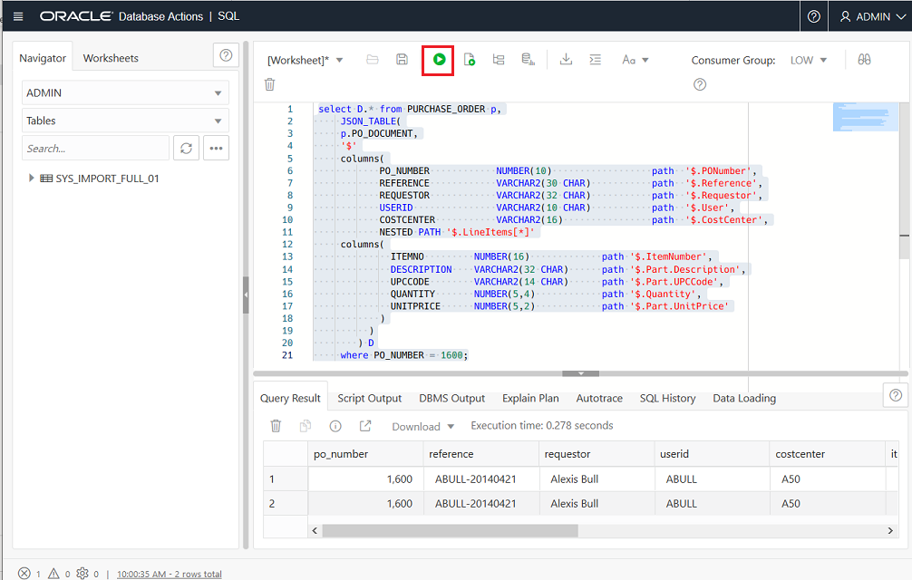
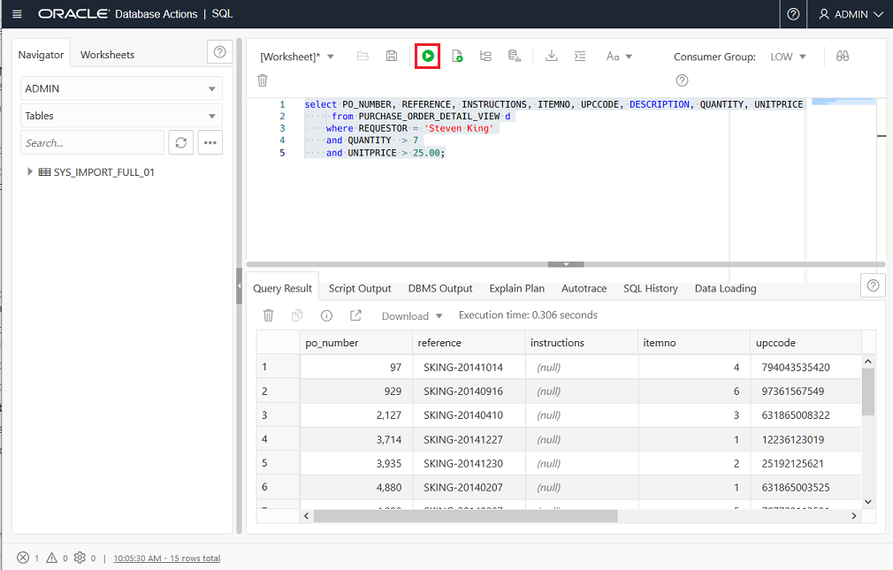

# JSON and Oracle Autonomous Database

## Introduction

This lab will show how **JSON** data can be stored and manipulated in the **Autonomous Database**. 

**Oracle Autonomous JSON Database** is Oracle Autonomous Transaction Processing, but specialized for developing NoSQL-style applications that use **JavaScript Object Notation (JSON)** documents. You can promote an Autonomous JSON Database service to an Autonomous Transaction Processing service if you need to have the need to store larger data set.           

There are three main parts to this lab.

  - **Create an External table on Object Storage** - You will use the **DBMS_CLOUD** package to create an external table on a JSON file in Object Storage.

  - **Insert and Update JSON Data** - You can use standard database APIs to insert or update JSON data. You can also work directly with JSON data contained in file-system files by creating an external table that exposes it to the database. You will add a row to your JSON table using insert query and then the Oracle SQL function `json_mergepatch` to update specific portions of a JSON document.

  - **Query JSON Documents using SQL** - You will see improvements in the simplicity of querying JSON documents using SQL. You will also see materialized views query rewriting has been enhanced so that queries with JSON_EXISTS, `JSON_VALUE` and other functions can utilize a materialized view created over a query that contains a `JSON_TABLE` function.

### JSON with Oracle Database

**JSON datatypes** are supported in **Oracle Autonomous Database and Oracle Database 19c**. JSON data can be used in Oracle Databases in similar ways. Unlike relational data, it can be stored, indexed, and queried without any need for a schema that defines the data. Oracle Database supports JSON natively with relational database features, including transactions, indexing, declarative querying, and views.

It's likely we want to send and receive JSON documents to and from and our database, and store them in tables. Oracle Database has a huge amount of functionality that makes this easy.

Oracle database provides a comprehensive implementation of SQL, for both analytics and batch processing. JSON held in the Oracle Database can be directly accessed via SQL, without the need to convert it into an intermediary form. JSON collections can be joined to other JSON collections or to relational tables using standard SQL queries.

**Storing and Managing JSON Documents**

JSON documents can be stored using a VARCHAR2, CLOB, or BLOB column. An IS JSON SQL constraint ensures that the column contains only valid JSON documents, allowing the database to understand that the column is being used as a container for JSON documents.

Oracle’s JSON capabilities are focused on providing full support for schemaless development and document-based storage. Developers are free to change the structure of their JSON documents as necessary. With the addition of JSON support, Oracle Database delivers the same degree of flexibility as a NoSQL JSON document store.

[](https://youtu.be/oiOCp23T1ZU)

The first thing to realize about JSON is that it remains a simple text format, which is relatively easy to read and inspect with the naked eye. At a syntax level, what starts to set JSON apart from other formats is the characters used to separate data, which are mainly constrained to apostrophes ', brackets ( ), [ ], { }, colons :, and commas ,. This listing illustrates what a JSON payload looks like:


**Estimated Lab Time**: 30 minutes.

## STEP 1: Start SQL Developer Web

1. Open **Database Actions** from your Database Details screen.
   
  

2. Enter the username `admin` and select **Next**.
   
   

3. Enter the **password** for `admin` and select **Sign In**. We have created this password on the Provisioning ADB Lab, we have recomended to use:`Oracle_12345`.
   
  

4. Under the **Development** region of the Database Actions page select the **SQL** tile, you will access to **SQL Developer Web**.
   
  
  

## STEP 2: Prepare your user to access Object Storage

1. During the section **Preparing the Data** on Load the source data into Object Storage Lab, you prepared a `create_credential.sql` file. **Copy and paste** the content of this into **SQL Developer Web** and **execute** using the **Run Script** button on the top of the page. 

  > Do not copy and paste the example script below.

  

  Now you are ready to load data from Object Store as the `admin` schema.

## STEP 3: Create an External Table on the file

To create an **external table** using a file stored in Object Storage you will use the **DBMS_CLOUD.CREATE_EXTERNAL_TABLE procedure**.

1. **Locate** the file URI (URL Path) for your JSON files. Go to **Menu** > **Storage** > **Object Storage & Archive** > **Buckets**.

  

2. **Click** on the name of your **lab-bucket**.

  

3. On the **Bucket details** screen **Click** on the **Action menu** (the 3 dots menu) next to the file **PurchaseOrders.dmp**. Select **View Object Details**.

  

4. On the **Object Details** dialog note the value for the **URL Path (URI)**.

  

5. Use the **URI** from the previous step in this SQL, **replacing** the text `FILE_URL_HERE` with the URI from your tenancy. **Execute** this SQL using the **Run Script** button on the top of the page.

  ```sql
  BEGIN
     DBMS_CLOUD.CREATE_EXTERNAL_TABLE(
      table_name =>'PURCHASE_EXT',
      credential_name =>'LAB_BUCKET_CRED',
      file_uri_list =>'FILE_URL_HERE',
      format => json_object('rejectlimit' value '10'),
      column_list => 'JSON_DOCUMENT VARCHAR(4000)');
  END;
  /
  ```

  The parameters you are providing are as follows:

  - **table_name**: This will be the new table's name.

  - **credential_name**: This is the credential that has access to the Object Storage location. This  credential and name was created as part of STEP 2 of this Lab.

  - **file_uri_list**: This is the file location. It can be specified in several formats see the  [documentation](.https://docs.oracle.com/en/cloud/paas/autonomous-database/adbsa/file-uri-formats. html) for details.

  - **format**: This describes the format for the data in the file. In this example you are   specifying a rejectlimit, but you could also specify record separators and other information  depending on the format of your file. See the [documentation](https://docs.oracle.com/en/cloud/  paas/autonomous-database/adbsa/format-options.html) for more details on the available formats.

  - **column_list**: A comma-delimited list of column names and data types for the external table.

  

## **STEP 4**: Load the JSON dump file into your database

1. **Create** your destination table `PURCHASE_ORDER` which will be used to contain JSON documents. The table has a column `PO_DOCUMENT` of type CLOB. The **IS JSON constraint** is applied to the column `PO_DOCUMENT`, ensuring that the column can store only well formed JSON documents. In Oracle there is no dedicated JSON data type. JSON documents are stored in the database using standard Oracle data types such as VARCHAR2, CLOB and BLOB. In order to ensure that the content of the column is valid JSON data, the new constraint IS JSON can be applied to a column. This constraint returns TRUE if the content of the column is well-formed, valid JSON and FALSE otherwise. **Copy** and **execute** the following statement using the **Run Script** button on the top of the page.

  ```sql
  create table PURCHASE_ORDER
  (
  ID RAW(16) NOT NULL,
  DATE_LOADED  TIMESTAMP(6) WITH TIME ZONE,
  PO_DOCUMENT CLOB CHECK (PO_DOCUMENT IS JSON)
  )
  /
  ```

2. **Use** the following statement to **copy** the JSON documents from the dump file into your new table. **Execute** the following statement using the **Run Script** button on the top of the page.

  ```sql
  insert into PURCHASE_ORDER
  select SYS_GUID(), SYSTIMESTAMP, JSON_DOCUMENT
  from PURCHASE_EXT
  where JSON_DOCUMENT IS JSON
  /
  commit
  /
  ```

## STEP 5: Insert a record

1. **Take a count** of the rows in your **purchase_order table**. Your number returned my vary. **Execute** the following statement using the **Run Script** button on the top of the page.

  ```sql
  select count(*) from purchase_order;
  ```

    
  
2. **Insert a record**. This new record will have a PONumber of 10001, and will contain 2 items. **Execute** the following statement using the **Run Script** button on the top of the page.

  ```sql
  INSERT INTO purchase_order
  VALUES (
    SYS_GUID(),
    to_date('05-MAY-2020'),
    '{"PONumber"             : 10001,
      "Reference"            : "SBELL-20141017",
      "Requestor"            : "Sarah Bell",
      "User"                 : "SBELL",
      "CostCenter"           : "A50",
      "ShippingInstructions" : {"name"    : "Sarah Bell",
      "Address" : {"street"  : "200 Sporting Green",
      "city"    : "South San Francisco",
      "state"   : "CA",
      "zipCode" : 99236,
      "country" : "United States of America"},
      "Phone"   : "983-555-6509"},
      "Special Instructions" : "Courier",
      "LineItems"            : [{"ItemNumber" : 1,
      "Part"       : {"Description" : "Making the Grade",
      "UnitPrice"   : 20,
      "UPCCode"     : 27616867759},
      "Quantity"   : 8.0},
      {"ItemNumber" : 2,
      "Part"       : {"Description" : "Nixon",
                                  "UnitPrice"   : 19.95,
                                  "UPCCode"     : 717951002396},
                                   "Quantity"   : 5},
                                  {"ItemNumber" : 3,
            "Part"       : {"Description" : "Eric Clapton: Best Of 1981-1999",
                                 "UnitPrice"   : 19.95,
                                 "UPCCode"     : 75993851120},
                                   "Quantity"   : 5.0}
                                  ]}');
  ```

  

3. **Verify** your insert by selecting the information for PONumber 10001. Please **copy** the **ID** for your record (highlighted in red in the screenshot) and **Save** it. This value WILL NOT MATCH the one in the screenshot. You will use this **ID** in the update section of the lab. **Execute** the following statement using the **Run Script** button on the top of the page.
    
  ```sql
  Select id from purchase_order j where j.po_document.PONumber=10001;
  ```
  
  


## **STEP 6**: Update a Record

You can use Oracle SQL function `json-mergepatch` or PL/SQL object-type method `json-mergepatch()` to update specific portions of a JSON document. In both methods you provide a JSON Merge Patch document, which declaratively specifies the changes to make to a a specified JSON document. JSON Merge Patch is an IETF standard.    

1. **Copy** the following update statement and **substitute the ID** you saved from the previous step in where it says `ID_copied_from_previous_step`. **Execute** the following statement using the **Run Script** button on the top of the page.

  ```sql
  update purchase_order
       set    PO_DOCUMENT = json_mergepatch (
           PO_DOCUMENT,
           '{
             "Requestor" : "MMARCH"
           }'
         )
      where id ='ID_copied_from_previous_step';
  ```

  

## STEP 7: Example Queries

The Oracle database allows a simple ‘dotted’ notation to be used to perform a limited set of operations on columns containing JSON. In order to use the dotted notation, a table alias must be assigned to the table in the FROM clause, and any reference to the JSON column must be prefixed with the assigned alias. All data is returned as VARCHAR2(4000). 

1. Let us look at customers who **ordered products** from a specific location, **South San Francisco**. **Execute** the following statement using the **Run Script** button on the top of the page.

  ```sql
  select j.PO_DOCUMENT.Reference,
  j.PO_DOCUMENT.Requestor,
  j.PO_DOCUMENT.CostCenter,
  j.PO_DOCUMENT.ShippingInstructions.Address.city
  from PURCHASE_ORDER j
  where j.PO_DOCUMENT.ShippingInstructions.Address.city = 'South San Francisco';
  ```

  

2. Next, let us find all the customers, and their purchase order numbers where they purchased an item tagged with a **specific UPCCode**. The `JSON_EXISTS` operator is used in the WHERE clause of a SQL statement. It is used to test whether or not a JSON document contains the content that matches the provided JSON path expression. 

  The `JSON_EXISTS` operator takes two arguments, a JSON column and a JSON path expression. It will return TRUE if the document contains a key that matches the JSON path expression, FALSE otherwise. `JSON_EXISTS` provides a set of modifiers that provide control over how to handle any errors encountered while evaluating the JSON path expression. The UPCCode in this example, represents the Universal Product Code. This is a type of code printed on retail product packaging to aid in identifying a particular item. It consists of two parts – the machine-readable barcode, which is a series of unique black bars, and the unique 12-digit number beneath it.

  ```sql
  SELECT po.po_document.PONumber,po.po_document.Requestor
  FROM purchase_order po
  WHERE json_exists(po.po_document,'$?(@.LineItems.Part.UPCCode == 85391628927)');
  ```

  

3. Next, find the customers who all are purchased a specific products **based on a PONumber**. The `JSON_TABLE` operator uses a set of JSON path expressions to map content from a JSON document into columns in a virtual table, which you can also think of as an inline view.  Once the contents of the JSON document have been exposed as columns, all of the power of SQL can be brought to bear on the content of the  JSON document. 

  ```sql
   select D.* from PURCHASE_ORDER p,
       JSON_TABLE(
       p.PO_DOCUMENT,
       '$'
       columns(
              PO_NUMBER            NUMBER(10)                  path  '$.PONumber',
              REFERENCE            VARCHAR2(30 CHAR)           path  '$.Reference',
              REQUESTOR            VARCHAR2(32 CHAR)           path  '$.Requestor',
              USERID               VARCHAR2(10 CHAR)           path  '$.User',
              COSTCENTER           VARCHAR2(16)                path  '$.CostCenter',
              NESTED PATH '$.LineItems[*]'
       columns(
                ITEMNO         NUMBER(16)             path '$.ItemNumber',
                DESCRIPTION    VARCHAR2(32 CHAR)      path '$.Part.Description',
                UPCCODE        VARCHAR2(14 CHAR)      path '$.Part.UPCCode',
                QUANTITY       NUMBER(5,4)            path '$.Quantity',
                UNITPRICE      NUMBER(5,2)            path '$.Part.UnitPrice'
              )
            )
          ) D
       where PO_NUMBER = 1600;
  ```

  

4. Next, use the description of the product to find all the customers who **purchased the item**. This example uses `JSON_TABLE`. 

  ```sql
     select D.* from PURCHASE_ORDER p,
     JSON_TABLE(
     p.PO_DOCUMENT,
     '$'
     columns(
            PO_NUMBER            NUMBER(10)                  path  '$.PONumber',
            REFERENCE            VARCHAR2(30 CHAR)           path  '$.Reference',
            REQUESTOR            VARCHAR2(32 CHAR)           path  '$.Requestor',
            USERID               VARCHAR2(10 CHAR)           path  '$.User',
            COSTCENTER           VARCHAR2(16)                path  '$.CostCenter',
            NESTED PATH '$.LineItems[*]'
     columns(
              ITEMNO         NUMBER(16)             path '$.ItemNumber',
              DESCRIPTION    VARCHAR2(32 CHAR)      path '$.Part.Description',
              UPCCODE        VARCHAR2(14 CHAR)      path '$.Part.UPCCode',
              QUANTITY       NUMBER(5,4)            path '$.Quantity',
              UNITPRICE      NUMBER(5,2)            path '$.Part.UnitPrice'
            )
          )
        ) D
     where description='A Walk on the Moon';
  ```
  

5. You can create relational views on JSON data, allowing the full power of SQL to be applied to the JSON content, without requiring any knowledge of the structure of the JSON or how to manipulate JSON using SQL. 

  Your users have a new query that they want to run regularly. They want to get information about orders that meet the critieria:

  - Ordered by a specific requester
  - Minimum 7 items in each order
  - Unit price minimum $25 in each order

  To accomplish this you will create two relational views. 

6. **Create view** `PURCHASE_ORDER_MASTER_VIEW`. This view selects the summary information about the order, including the PO Number, and the Shipping information.

  ```sql
  create or replace view PURCHASE_ORDER_MASTER_VIEW
  AS 
  SELECT M.* FROM PURCHASE_ORDER p,
  JSON_TABLE(p.PO_DOCUMENT,
       '$'
       columns
     	  PO_NUMBER NUMBER(10) PATH '$.PONumber',
       	REFERENCE VARCHAR2(30 CHAR) PATH '$.Reference',
       	REQUESTOR VARCHAR(128) PATH '$.Requestor',
       	USERID VARCHAR2(10 CHAR) PATH '$.User',
       	COSTCENTER VARCHAR2(16) PATH '$.CostCenter',
       	SHIP_TO_NAME VARCHAR2(20 CHAR) PATH '$.ShippingInstructions.name',
       	SHIP_TO_STREET VARCHAR2(32 CHAR) PATH '$.ShippingInstructions.Address.street',
       	SHIP_TO_CITY VARCHAR2(32 CHAR) PATH '$.ShippingInstructions.Address.city',
       	SHIP_TO_COUNTY VARCHAR2(32 CHAR) PATH '$.ShippingInstructions.Address.county',
       	SHIP_TO_POSTCODE VARCHAR2(32 CHAR) PATH '$.ShippingInstructions.Address.postcode',
       	SHIP_TO_STATE VARCHAR2(2 CHAR) PATH '$.ShippingInstructions.Address.state',
      	SHIP_TO_PROVINCE VARCHAR2(2 CHAR) PATH '$.ShippingInstructions.Address.province',
       	SHIP_TO_ZIP VARCHAR2(8 CHAR) PATH '$.ShippingInstructions.Address.zipCode',
       	SHIP_TO_COUNTRY VARCHAR2(32 CHAR) PATH '$.ShippingInstructions.Address.country',
       	SHIP_TO_PHONE VARCHAR2(24 CHAR) PATH '$.ShippingInstructions.Phone[0].number',
       	INSTRUCTIONS VARCHAR2(2048 CHAR) PATH '$.SpecialInstructions'
  ) m ;
  ```

7. **Create view** `PURCHASE_ORDER_DETAIL_VIEW`. This view contains nested information related to the **Items on the order**. 

  ```sql
  create or replace view PURCHASE_ORDER_DETAIL_VIEW
  AS
  SELECT D.* FROM PURCHASE_ORDER p,
  JSON_TABLE(
       p.PO_DOCUMENT,
      '$'
       	columns (
       	PO_NUMBER NUMBER(10) PATH '$.PONumber',
       	REFERENCE VARCHAR2(30 CHAR) PATH '$.Reference',
       	REQUESTOR VARCHAR(128) PATH '$.Requestor',
       	USERID VARCHAR2(10 CHAR) PATH '$.User',
       	COSTCENTER VARCHAR2(16) PATH '$.CostCenter',
       	SHIP_TO_NAME VARCHAR2(20 CHAR) PATH '$.ShippingInstructions.name',
       	SHIP_TO_STREET VARCHAR2(32 CHAR) PATH '$.ShippingInstructions.Address.street',
       	SHIP_TO_CITY VARCHAR2(32 CHAR) PATH '$.ShippingInstructions.Address.city',
       	SHIP_TO_COUNTY VARCHAR2(32 CHAR) PATH '$.ShippingInstructions.Address.county',
       	SHIP_TO_POSTCODE VARCHAR2(32 CHAR) PATH '$.ShippingInstructions.Address.postcode',
       	SHIP_TO_STATE VARCHAR2(2 CHAR) PATH '$.ShippingInstructions.Address.state',
       	SHIP_TO_PROVINCE VARCHAR2(2 CHAR) PATH '$.ShippingInstructions.Address.province',
       	SHIP_TO_ZIP VARCHAR2(8 CHAR) PATH '$.ShippingInstructions.Address.zipCode',
        	SHIP_TO_COUNTRY VARCHAR2(32 CHAR) PATH '$.ShippingInstructions.Address.country',
       	SHIP_TO_PHONE VARCHAR2(24 CHAR) PATH '$.ShippingInstructions.Phone[0].number',
       	INSTRUCTIONS VARCHAR2(2048 CHAR) PATH '$.SpecialInstructions',
       	NESTED PATH '$.LineItems[*]'
       	columns (
         		ITEMNO        NUMBER(38) PATH '$.ItemNumber',
        		DESCRIPTION   VARCHAR2(256 CHAR) PATH '$.Part.Description',
       		UPCCODE       VARCHAR2(14 CHAR) PATH '$.Part.UPCCode',
      		QUANTITY      NUMBER(12,4) PATH '$.Quantity',
      		UNITPRICE     NUMBER(14,2) PATH '$.Part.UnitPrice'
       	)
       )
  ) d;
  ```

8. **Query** `PURCHASE_ORDER_DETAIL_VIEW` to find **Purchase Orders** that meet the criteria and were ordered by 'Stephen King'.

  ```sql
  select PO_NUMBER, REFERENCE, INSTRUCTIONS, ITEMNO, UPCCODE, DESCRIPTION, QUANTITY, UNITPRICE
       from PURCHASE_ORDER_DETAIL_VIEW d
      where REQUESTOR = 'Steven King'
      and QUANTITY  > 7
      and UNITPRICE > 25.00;
  ```

      

9. You can use the `PRETTY` option when querying JSON data using JSON_QUERY. This will pretty-print the values and return them as a character string. `JSON_VALUE` selects a scalar value from JSON data and returns it as a SQL value. You can also use `json_value` to create function-based B-tree indexes for use with JSON data . The function `json_value` has two required arguments. The first argument to `json_value` is a SQL expression that returns an instance of either a scalar SQL data type or a user-defined SQL object type. A scalar return value can be of data type VARCHAR2, BLOB, or CLOB. The first argument can be a table or view column value, a PL/SQL variable, or a bind variable with proper casting. The result of evaluating the SQL expression is used as the context item for evaluating the path expression.

  The second argument to json_value is a SQL/JSON path expression followed by optional clauses RETURNING, ON ERROR, and ON EMPTY. The path expression must target a single scalar value, or else an error occurs. 

  **Compare** the output from these 2 queries accessing the same data, retrieving items on Purchase Order number 97. **Execute** the following statement using the **Run Script** button on the top of the page.

  First **run** it **without the PRETTY** option.

    ```sql
    select JSON_QUERY(PO_DOCUMENT,'$.LineItems[0]') LINEITEMS
    from PURCHASE_ORDER p
    where JSON_VALUE (PO_DOCUMENT,'$.PONumber')  = 97;
    ```

    

10. Next **try** it **with PRETTY**. You can see that the output is much more readable by a human. 

  ```sql
  select JSON_QUERY(PO_DOCUMENT,'$.LineItems[0]' PRETTY) LINEITEMS
  from PURCHASE_ORDER p
  where JSON_VALUE (PO_DOCUMENT,'$.PONumber') = 97;
  ```
  
   


_Congratulations, you have completed this lab on JSON in Autonomous Database._

## Learn More

- [JSON](https://docs.oracle.com/en/database/oracle/oracle-database/19/adjsn/index.html)

## Acknowledgements

- Authors:  Balasubramanian Ramamoorthy, Arvind Bhope, Melanie Ashworth-March
- Last Update by:  Melanie Ashworth-March / June 2021