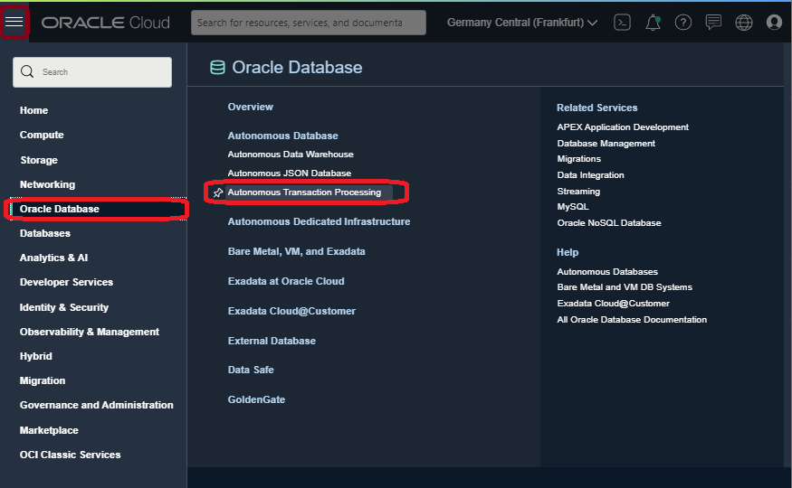
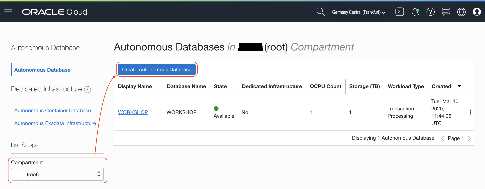
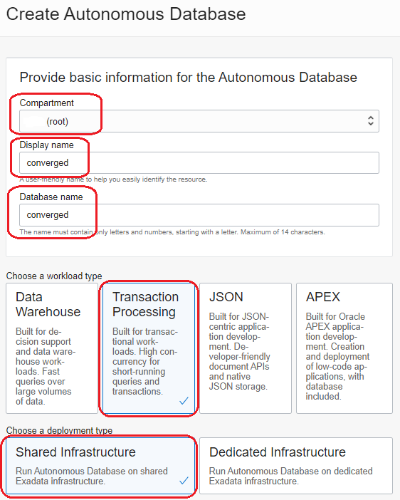
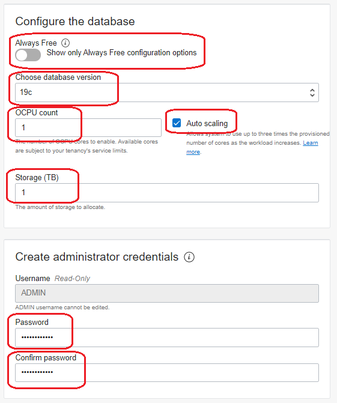
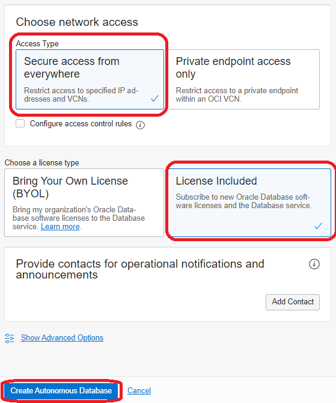
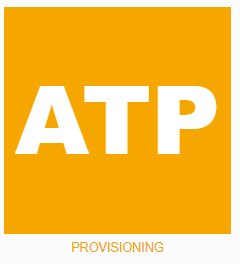
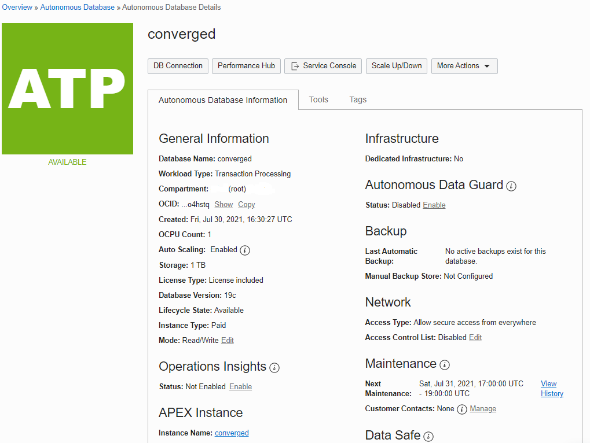

# Provisioning an Autonomous Database

## Introduction

This lab walks you through the steps to get started using the Oracle Autonomous Database on Oracle Cloud. There are two types of workloads:

- Autonomous Data Warehouse (ADW)
- Autonomous Transaction Processing (ATP)

In this lab, you will provision a new **Autonomous Transaction Processing (ATP)** instance.

Let check the most important characteristics of **Oracle Autonomous Databases**.

**Self-driving**
- Automate database provisioning, tuning, and scaling.
- Provisions highly available databases, configures and tunes for specific workloads, and scales compute resources when needed, all done automatically.

**Self-securing**
-  Automate data protection and security.
- Protect sensitive and regulated data automatically, patch your database for security vulnerabilities, and prevent unauthorized access—all with Oracle Autonomous Database.

**Self-repairing**
- Automate failure detection, failover, and repair.
- Detect and protect from system failures and user errors automatically and provide failover to standby databases with zero data loss.
- Perfect for Developers!

*Note: While this lab uses ATP, the steps are identical for creating an ADW database.*

**Estimated Lab Time**: 15 minutes

### Objectives

In this lab, you will:

-   Learn how to provision a new Autonomous Database

### Prerequisites

To complete this lab, you need to have the following:

- Logged into your Oracle Cloud Account

## **STEP 1**: Provision ATP

1. Go to **Menu** > **Oracle Database** > **Autonomous Transaction Processing**.

   

2. Click **Create Autonomous Database**.

   

   Check if you are in the **root compartment**.

   > Compartments are a logical separation of resources to attach roles and permissions. It will make possible to create your team structure in compartments so you know who manage what resources. Not necessary at this stage.

3. Fill out the following information:

   - Compartment: `root`
   - Display name: `converged`
   - Database name: `converged`
   - Choose a workload type: `Transation Processing`
   - Choose a deployment type: `Shared Infrastructure`

   

4. Fill the next part of the provisioning form with the following values.

   - Always Free: Turn it `on`, but it will work if you leave it `off` like in the screenshot.
   
   You will have visible the **Always Free** logo next to the name of your database:

   

   - Choose database version: `19c`, if your region has 21c it will equally work.
   - OCPU count: `1` or default value.
   - Storage (TB): `1` or default value.
   - Auto Scaling: `on` or default value.

   Auto scaling you can leave it off but it is a nice feature as the ATP database will scale if the workload is increasing and scale down automatically if the workload reduces. Zero downtime during the process. It's cool, isn't it?
   
   - Password: `Oracle_12345`
   - Confirm password: `Oracle_12345`
   
   > Reminder: Note your password in a safe location as the reset process is not documented as part of this lab.
   
   

5. Fill the last part of the provisioning form with the following values.
   
   - Access Type: `Allow secure access from everywhere`
   - Choose a license type: `License Included`

   Click **Create Autonomous Database**.

    

6. We will see the new ATP Database provisioning.

   Wait for the icon to change from `PROVISIONING`:

   

   To `ACTIVE` state:

   

7. Your Autonomous Transaction Processing is ready to use.
   
   Look around the details and get familiar with the buttons and tabs on this page.

   

_At this point, you are ready to start learning! Please proceed._

## **Acknowledgements**

- **Author** - Melanie Ashworth-March, Oracle Solution Center
- **Contributor** - Priscila Iruela, Victor Martin