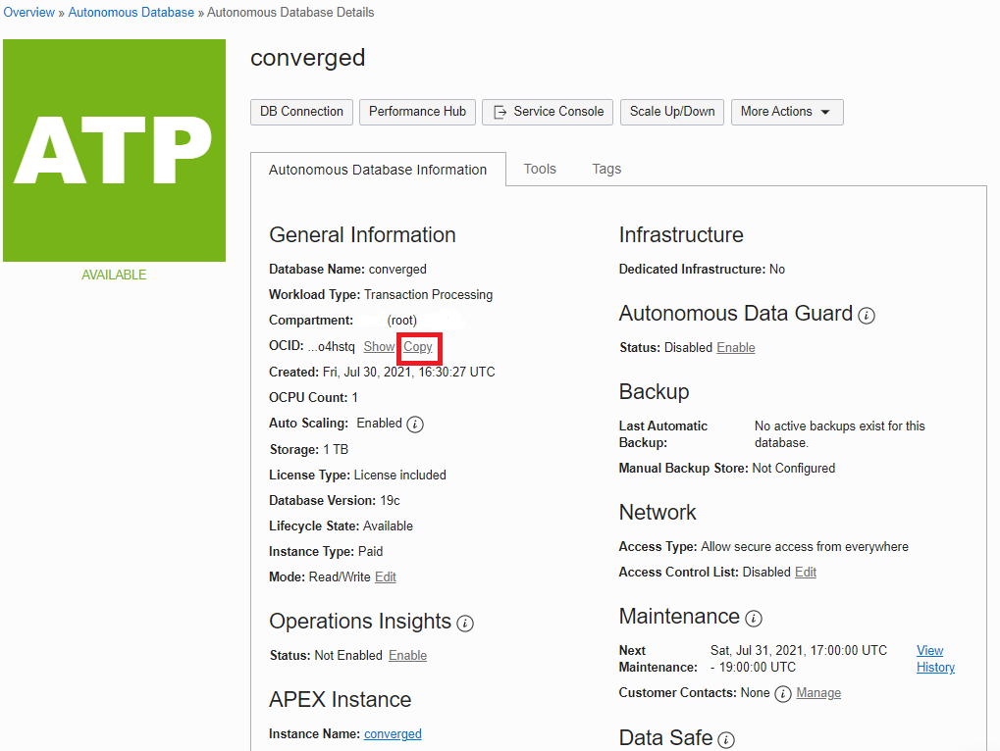
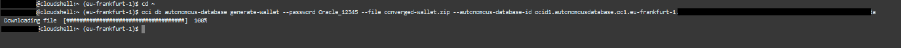
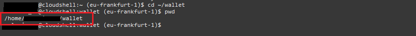
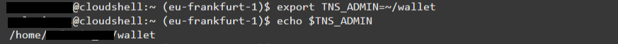
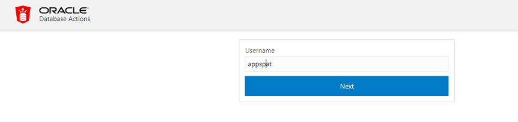
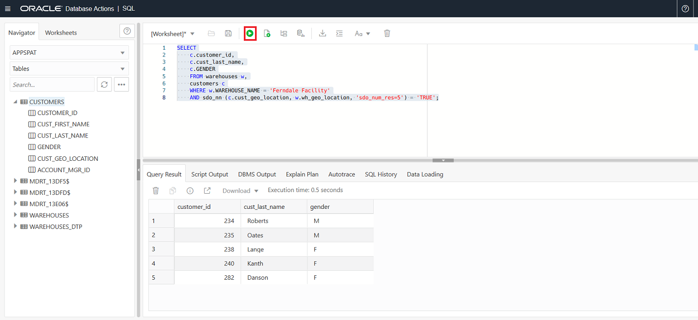
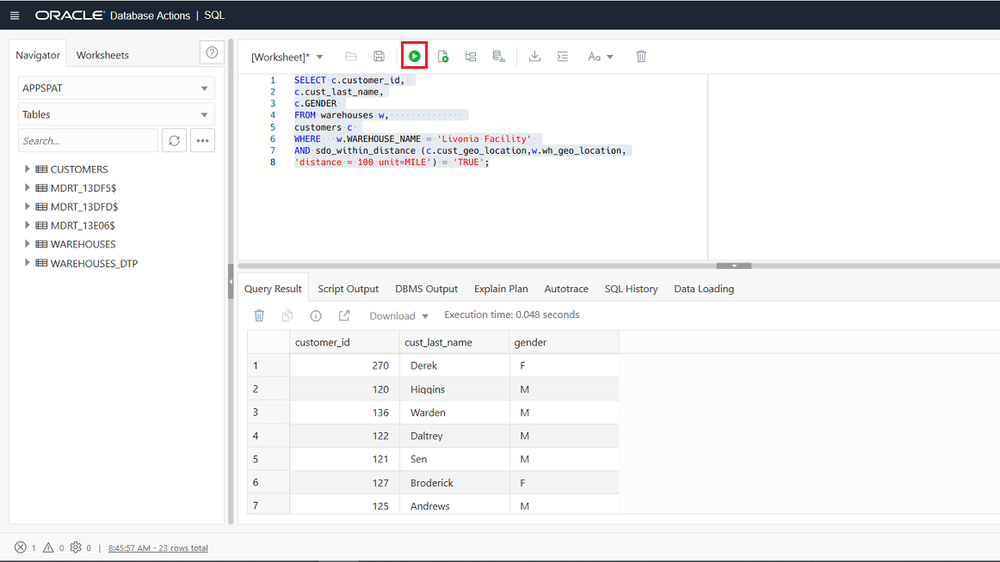

# Oracle Spatial

## Introduction
This lab walks you through the steps of setting up the environment for Spatial lab and then takes you through. You can connect to the Oracle Database instance using any client of your choice. The instructions for this lab, document using **SQL Developer Web** and **SQL*Plus** in Cloud Shell.

## Objectives


### About Oracle Spatial

**Oracle Spatial** is an integrated set of functions, procedures, data types, and data models that support Spatial analytics. The Spatial features enable Spatial data to be stored, accessed, and analyzed quickly and efficiently in an Oracle database.

Oracle Spatial is designed to make Spatial data management easier and more natural to users of location-enabled applications and geographic information system (GIS) applications. Once Spatial data is stored in an Oracle database, it can be easily manipulated, retrieved, and related to all other data stored in the database.

A common example of Spatial data can be seen in a road map. A road map is a two-dimensional object that contains points, lines, and polygons that can represent cities, roads, and political boundaries such as states or provinces. A road map is a visualization of geographic information.

The data that indicates the Earth location (such as longitude and latitude) of these rendered objects is the Spatial data. When the map is rendered, this Spatial data is used to project the locations of the objects on a two-dimensional piece of paper.

[](https://youtu.be/Q2jm93Rm95g)

Oracle Spatial consists of the following:

-	Schema (MDSYS)
-	A Spatial indexing mechanism  	
-	Operators, functions, and procedures
-	Native data type for vector data called SDO\_GEOMETRY (An Oracle table can contain one or more SDO\_GEOMETRY columns)


### Scenario
MyCompany has several major warehouses. It needs to locate its customers who are near a given warehouse, to inform them of new advertising promotions. To locate its customers and perform location-based analysis, MyCompany must store location data for both its customers and warehouses.

We will be using three tables – CUSTOMERS, WAREHOUSES and WAREHOUSES\_DTP.

Each table stores location using Oracle's native Spatial data type, SDO\_GEOMETRY. A location can be stored as a point in an SDO\_GEOMETRY column of a table. The customer's location is associated with longitude and latitude values on the Earth's surface—for example, -63.13631, 52.485426.

**Estimated Lab Time:** 30 minutes.

## TASK 1: Prepare your environment

If you have **downloaded** the **wallet** for your database into your **cloud shell** in a previous lab, skip to **Extract the wallet**. If you do not have a wallet, follow this process.

### Download the Wallet

1. **Navigate** to the **Autonomous Database Details** page for your database. Select the **Copy** next to the **OCID** for your database.

   

2. Start **Cloud Shell** by selecting the icon in the **menu bar**.

   
   
   After a few moments, the cloud shell will open at the **bottom** of your web browser window.

3. **Replace** **YOUR-OCID-HERE** in the command below with the **OCID** for your database. You will be setting the wallet password to the same value as the ADB admin password for ease of use. This is not a recommended practice and just used for the purposes of this lab. The wallet will be created with the name `converged-wallet.zip`.

   ````
   cd ~
   oci db autonomous-database generate-wallet --password Oracle_12345 --file converged-wallet.zip --autonomous-database-id YOUR-OCID-HERE
   ````

   

   The wallet file will be downloaded to your cloud shell file system under your home directory.

4. Enter the ls (list) command in your cloudshell below to verify the **converged-wallet.zip** was created

   ````
   ls
   ````

  

### Extract the wallet

1. Use the **unzip** command below to unzip the contents of the wallet file into a directory that you will call **wallet**. The directory will  be created automatically by  the unzip command.

   ````
   cd ~
   unzip -d wallet converged-wallet.zip
   ````
   
   

2. Next you need to modify the **sqlnet.ora** file located in the wallet directory to include the location of the wallet contents (e.g the directory holding your tnsnames.ora). If you are unsure of the full directory name and path, you can cut-and-paste this from the output of the **pwd** operation.

   ````
   cd ~/wallet
   pwd
   ````

   

3. **Edit** the contents of the **sqlnet.ora** file.

   ````
   vi sqlnet.ora
   ````
   ​Change the first line in the sqlnet.ora file to use your directory name as it appears in your Oracle Cloud Shell prompt:

   *OLD:* `WALLET_LOCATION = (SOURCE = (METHOD = file) (METHOD_DATA = (DIRECTORY="?/network/admin")))`

   *NEW:* `WALLET_LOCATION = (SOURCE = (METHOD = file) (METHOD_DATA = (DIRECTORY="/home/<YOUR USERNAME HERE>/wallet")))`

   So in the screenshot example, my wallet directory is `/home/melanie_as/wallet` so my entry is `WALLET_LOCATION = (SOURCE = (METHOD = file) (METHOD_DATA = (DIRECTORY="/home/melanie_as/wallet")))` Use your information to complete this change.

   

4. **Change** directory back to your home Directory.

   ````
   cd ..
   ````

## TASK 2: Load the data

In this step you will load the data for the lab using Oracle Data Pump. 

### Storing your object store authentication token credentials in the database

To access data in the Object Storage you must enable your database user to authenticate itself with the Object Storage using your object store account and authentication token. You do this by creating a private CREDENTIAL object for your user that stores this information encrypted in your Autonomous Database instance. This encrypted connection information is only usable by your user schema. 

1. In **cloud shell**, set the TNS_ADMIN environment variable to your **wallet** directory. The tilde `~` symbol is a shortcut for your home directory path. 

   ```
   export TNS_ADMIN=~/wallet
   echo $TNS_ADMIN
   ```

   

2. **Connect** using **SQL*Plus** command line from your cloud shell prompt, using your **admin** password instead of YOUR-ADMIN-PASSWORD (We have suggested `Oracle_12345`) and your database name instead of YOUR-DB-NAME (We have suggested `converged_tp`).

   ```sql
   sqlplus admin/YOUR-ADMIN-PASSWORD@YOUR-DB-NAME_tp
   ```
   The recomended option is:

   ```sql
   sqlplus admin/Oracle_12345@converged_tp
   ```

   

   
3. During the section '**Preparing the Data**' you prepared a `create_credential.sql` file. **Copy and paste** the contents of this into **SQL*Plus** session. You only need to create the credential once per schema during the lab. If you receive the error `ORA-20022: Credential "ADMIN"."LAB_BUCKET_CRED" already exists` then you have already created this credential as part of a previous step in this lab. 

   

4. **Prepare** the destination schema for your imported data. In **SQL*Plus** execute the following commands

   ```sql
   create user appspat identified by OracleLab1234;
   grant dwrole to appspat;
   alter user appspat quota unlimited on data;
   BEGIN
         ORDS_ADMIN.ENABLE_SCHEMA(
           p_enabled => TRUE,
           p_schema => 'appspat',
           p_url_mapping_type => 'BASE_PATH',
           p_url_mapping_pattern => 'appspat',
           p_auto_rest_auth => TRUE
         );
         COMMIT;
       END;
       /

   ```

5. You have **verified** that your wallet has been correctly configured by using **SQL*Plus** and have created a credential to access the object storage bucket. You have prepared the destination schema, granting it the DWROLE, unlimited quota on the data tablespace, and enabled the schema for **SQL Developer Web** by enabling ORDS. Now you are ready to load data from Object Store as the admin user.

6. **Quit** SQL*Plus.

   ```
   quit
   ```

### Running impdp

1. **Locate** the file URI for your datapump export file. Go to **Menu** > **Storage** > **Object Storage & Archive** > **Buckets**.

   
   
2. Click on the name of your **lab-bucket**. 
   
   

3. On the **bucket** details screen click on the action menu (the 3 dots) next to the file **export_spatial22Sep2020.dmp**. **Select** View Object Details.
   
   

4. On the **Object Details** dialog note the value for the **URL Path (URI)**:
   
   

   
5. In Cloud Shell execute the following command to import the data, replacing the following values:

   - YOUR-ADMIN-PASSWORD: replace with the password for your admin account. (We have suggested `Oracle_12345`)

   - YOUR-DB-NAME: replace with your database nam e, and make sure you are connecting to the _high service (We have suggested `converged_tp`)

   - YOUR-FILE-URI: The URI for the dump file stored in your lab bucket as noted in the previous step

   ```
   impdp admin/YOUR-ADMIN-PASSWORD@YOUR-DB-NAME_tp \
   credential=lab_bucket_cred  \
   directory=data_pump_dir \
   dumpfile=YOUR-FILE-URI 
   ```

   

   The import should take **less than a minute** to run. 

6. **2 errors** are expected in the output `ORA-31684: Object type USER:"APPSPAT" already exists` and `ORA-39083: Object type ROLE_GRANT failed to create with error: ORA-01924: role 'DBA' not granted or does not exist`.

   


## TASK 3: Connect to SQL Developer Web

In the previous step you executed commands to **grant** the appspat user privileges and setup **SQL Developer Web** using **Rest Services (ORDS)**. You are now going to connect as this new user. 

1. On your **Database Details** screen select the **Tools** tab and select **Open Database Actions**.

   

2. Enter the username `appspat` and select **Next**.

   

3. **Enter** the password for appspat `OracleLab1234` and **Sign in**.

   

4. Under the **Development** region of the Database Actions page select the **SQL** tile.

   


## TASK 4: Examining your Spatial data

As part of the **dataload** you created the tables CUSTOMERS, WAREHOUSES_DTP and WAREHOUSES.

Examine one of these tables using **SQL Developer Web**.

1. **Select** the **Customers** table in the list of tables, and right click, and select **Edit**.

   

2. This opens the **Table Properties** window. You can see that the customer table has a column **CUST\_GEO\_LOCATION** which is of the special **SDO\_GEOMETRY** data type to store the Spatial data.

   

3. Before the Spatial index was created in the original data load, entries were inserted into the `USER_SDO_GEOM_METADATA` view to provide information about dimensions associated with the data, for example.

   ```sql
   insert into user_sdo_geom_metadata
   (TABLE_NAME,
        COLUMN_NAME,
        DIMINFO,
        SRID)
     VALUES (
   'CUSTOMERS','CUST_GEO_LOCATION',
   MDSYS.SDO_DIM_ARRAY(MDSYS.SDO_DIM_ELEMENT('X', -180, 180, 0.05),
                  MDSYS.SDO_DIM_ELEMENT('Y', -90, 90, 0.05)),
   4326);
   ```

**Here is a description of the items that were entered:**

  - **TABLE-NAME**: Name of the table which contains the Spatial data.
  - **COLUMN-NAME**: Name of the `SDO_GEOMETRY` column which stores the Spatial data.
  - **MDSYS.SDO\_DIM_ARRAY**: Constructor which holds the `MDSYS.SDO_DIM_ELEMENT` object, which in turn stores the extents of the Spatial data  in each dimension (-180.0, 180.0), and a tolerance value (0.05). The tolerance is a round-off error value used by Oracle Spatial, and is in meters for longitude and latitude data. In this example, the tolerance is 5 mm.
  - **4326**: Spatial reference system id (SRID): a foreign key to an Oracle dictionary table (`MDSYS.CS_SRS`) that contains all the supported coordinate systems. It is important to associate your customer's location to a coordinate system. In this example, 4326 corresponds to "Longitude / Latitude (WGS 84).".

4. Select the **Indexes** item in the sidebar. You can see that there has been an index created called **CUSTOMERS\_SIDX**. This index is on the CUSTOMER_SDO column. This type of index on Spatial data was created using a command similar to `CREATE INDEX customers_sidx ON customers(CUST_GEO_LOCATION) indextype is mdsys.spatial_index;`

   

5. Select **Close** to leave table properties without making any changes.


## TASK 5: Run Spatial Queries

#### Query #1: Find the five customers closest to the warehouse whose warehouse name  is 'Ferndale Facility'

- **The SDO\_NN** (**N**earest **N**eighbour) operator returns the SDO_NUM\_RES (number of results) value of the customers from the CUSTOMERS table who are closest to warehouse 3. The first argument to SDO\_NN (c.cust-geo-location this lab ) is the column to search. The second argument to SDO\_NN (w.wh\_geo\_location in this lab) is the location you want to find the neighbors nearest to. No assumptions should be made about the order of the returned results. For example, the first row returned is not guaranteed to be the customer closest to warehouse 3. If two or more customers are an equal distance from the warehouse, then either of the customers may be returned on subsequent calls to SDO\_NN.

- When using the **SDO\_NUM\_RES** parameter (limiting the number of results returned), other constraints should be used cautiously in the WHERE clause. **SDO\_NUM\_RES** takes only proximity into account. For example, if you added a criterion to the WHERE clause because you wanted the five closest female customers, and four of the five closest customers are male, the query above would return one row. This behavior is specific to the SDO-NUM-RES parameter, and its results may not be what you are looking for. You will learn how to find the five closest female customers in the discussion of query 3.


   ```sql
   SELECT c.customer_id, c.cust_last_name, c.GENDER
   FROM warehouses w, customers c
   WHERE w.WAREHOUSE_NAME = 'Ferndale Facility'
   AND sdo_nn (c.cust_geo_location, w.wh_geo_location, 'sdo_num_res=5') = 'TRUE';
   ```

   

#### Query #2: Find the five customers closest to warehouse named 'Livonia Facility' and put the results in order of distance

In this query you are not just looking for the Nearest Neighbour of your warehouse, but also calculating the distance. 

- The **SDO\_NN\_DISTANCE** operator is an ancillary operator to the SDO\_NN operator; it can only be used within the SDO\_NN operator and not on its own. The argument for this operator is a number that matches the number specified as the last argument of SDO_NN; in this example it is 1. There is no hidden meaning to this argument, it is simply a tag. If SDO\_NN\_DISTANCE() is specified, you can order the results by distance and guarantee that the first row returned is the closest. If the data you are querying is stored as longitude and latitude, the default unit for SDO\_NN\_DISTANCE is meters.

- The **SDO_NN** operator also has a UNIT parameter that determines the unit of measure returned by SDO\_NN\_DISTANCE.

- The **ORDER BY DISTANCE** clause ensures that the distances are returned in order, with the shortest distance first.

   ```sql
   SELECT c.customer_id, c.cust_last_name, c.GENDER,   
   round( sdo_nn_distance (1), 2) distance_in_miles 
   FROM warehouses w, customers c 
   WHERE w.WAREHOUSE_NAME = 'Livonia Facility' 
   AND sdo_nn (c.cust_geo_location, w.wh_geo_location, 'sdo_num_res=5  unit=mile', 1) = 'TRUE'
   ORDER BY distance_in_miles;
   ```
    
   


#### Query #3: Find the five female customers closest to warehouse named 'Livonia Facility', put the results in order of distance, and give the distance in miles

- **SDO\_BATCH\_SIZE** is a tunable parameter that may affect your query's performance. If you do not set it, or set it to '0' then then it will calculate a batch size that is suitable for the result set size. However, the calculated batch size may not be optimal, and the calculation incurs some processing overhead. SDO\_NN internally calculates SDO\_BATCH\_SIZE number of distances at a time. The initial batch of rows returned may not satisfy the constraints in the WHERE clause, so the number of rows specified by SDO\_BATCH\_SIZE is continuously returned until all the constraints in the WHERE clause are satisfied. You should choose a SDO\_BATCH\_SIZE that initially returns the number of rows likely to satisfy the constraints in your WHERE clause.

- The **UNIT** parameter used within the SDO\_NN operator specifies the UNIT of measure of the SDO\_NN\_DISTANCE parameter. The default UNIT is the unit of measure associated with the data. For longitude and latitude data, the default is meters. The possible values for the UNIT parameter are documented in the table MDSYS.SDO\_DIST\_UNITS.

- **c.gender = 'F'** and **ROWNUM < 6** are the additional constraints in the WHERE clause to limit the results to people who are female, and the ROWNUM < 6 clause is necessary to limit the number of results returned to fewer than 6. 

- The **ORDER BY DISTANCE\_IN\_MILES** clause ensures that the distances are returned in order, with the shortest distance first and the distances measured in miles.

   ```sql
   SELECT c.customer_id,c.cust_last_name,c.GENDER, 
   round( sdo_nn_distance(1), 2) distance_in_miles
   FROM warehouses w,   customers c
   WHERE w.WAREHOUSE_NAME = 'Livonia Facility'
   AND sdo_nn (c.cust_geo_location, w.wh_geo_location,
   'sdo_batch_size =5 unit=mile', 1) = 'TRUE'
   AND c.GENDER = 'F'
   AND rownum < 6
   ORDER BY distance_in_miles;
   ```

   


#### Query #4: Find all the customers within 100 miles of warehouse named 'Livonia Facility'

- The **SDO\_WITHIN\_DISTANCE** operator returns the customers from the customers table that are within 100 miles of warehouse 'Livonia Facility'. The first argument to SDO\_WITHIN\_DISTANCE (c.cust\_geo\_location) is the column to search. The second argument to SDO\_WITHIN\_DISTANCE (w.wh\_geo\_location)i s the location you want to determine the distances from. No assumptions should be made about the order of the returned results. For example, the first row returned is not guaranteed to be the customer closest to warehouse.

- The **DISTANCE** parameter used within the SDO\_WITHIN\_DISTANCE operator specifies the distance value; in this example it is 100.

- The **UNIT** parameter used within the SDO\_WITHIN\_DISTANCE operator specifies the UNIT of measure of the DISTANCE parameter. The default UNIT is the unit of measure associated with the data. For longitude and latitude data, the default is meters; so in this lab you need to specify the unit=miles.

   ```sql
   SELECT c.customer_id, c.cust_last_name, c.GENDER 
   FROM warehouses w, customers c 
   WHERE w.WAREHOUSE_NAME = 'Livonia Facility' 
   AND sdo_within_distance (c.cust_geo_location,w.wh_geo_location,
   'distance = 100 unit=MILE') = 'TRUE';
   ```

   


#### Query #5: Find all the customers within 100 miles of warehouse named 'Livonia Facility', put the results in order of distance, and give the distance in miles.

- The **SDO\_GEOM.SDO\_DISTANCE** function computes the exact distance between the customer's location and 'Livonia Facility'. The first argument to SDO\_GEOM.SDO\_DISTANCE (c.cust\_geo\_location) contains the customer's location whose distance from 'Livonia Facility' is to be computed. The second argument to SDO\_WITHIN\_DISTANCE (w.wh\_geo\_location) is the location of warehouse 'Livonia Facility', whose distance from the customer's location is to be computed.

- The third argument to **SDO\_GEOM.SDO\_DISTANCE** (0.005) is the tolerance value. The tolerance is a round-off error value used by Oracle Spatial. The tolerance is in meters for longitude and latitude data. In this example, the tolerance is 5 mm.

- The **UNIT** parameter used within the SDO\_GEOM.SDO\_DISTANCE parameter specifies the UNIT of measure of the distance computed by the SDO\_GEOM.SDO\_DISTANCE function. The default UNIT is the unit of measure associated with the data. For longitude and latitude data, the default is meters. In this example you are specifying miles.

- The **ORDER BY DISTANCE\_IN\_MILES** clause ensures that the distances are returned in order, with the shortest distance first and the distances measured in miles.

   ```sql
   SELECT c.customer_id, c.cust_last_name, c.GENDER, 
   round(sdo_geom.sdo_distance (c.cust_geo_location, w.wh_geo_location,.005,'unit=MILE'), 2) distance_in_miles
   FROM warehouses w, customers c
   WHERE  w.WAREHOUSE_NAME = 'Livonia Facility' 
   and
   sdo_within_distance (c.cust_geo_location, w.wh_geo_location, 'distance = 100 unit=MILE') = 'TRUE'
   ORDER BY distance_in_miles;
   ```

   


#### Query #6: Find all the customers inside a 30 min drive time polygons  

- **Drive Time polygons** are simply the areas reachable from a location within an amount of time. They are used for things like placing new stores or office locations; i.e. locate a new office so that all our employees can reach our office within a given drive time. Or locate a new store with a drive time polygon containing new target customers and not cannibalizing another store location. The table WAREHOUSES_DTP has been populated with information for each warehouse, and the area that is within 30 minutes drive.

- The **SDO\_INSIDE** function returns 'TRUE'  if the the first argument  (a.cust_geo_location - where the customer is located) is INSIDE the  geometry represented by the second parameter (b. geometry - the area that is within 30 minutes drive time of that warehouse). 

  ```sql
  select customer_id, warehouse_name
  from customers a, warehouses_dtp b
  where b.drive_time_min = 30
  and sdo_inside(a.cust_geo_location, b.geometry) = 'TRUE';
  ```

   


### Learn More

During this lab you have learned how to query SPATIAL data in the Oracle Autonomous Database.  For more information see the Oracle Documentation on [SPATIAL](https://docs.oracle.com/en/database/oracle/oracle-database/19/spatial-and-graph.html).

_Congratulations, you have completed this lab on Spatial in Autonomous Database._

## Acknowledgements

- **Authors** - Balasubramanian Ramamoorthy, Arvind Bhope, Melanie Ashworth-March
- **Contributor**: Priscila Iruela, Victor Martin
- **Last Updated By/Date** - Melanie Ashworth-March, Rob Watson - June 2021