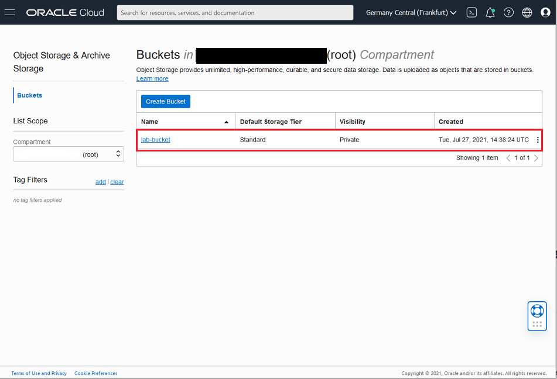
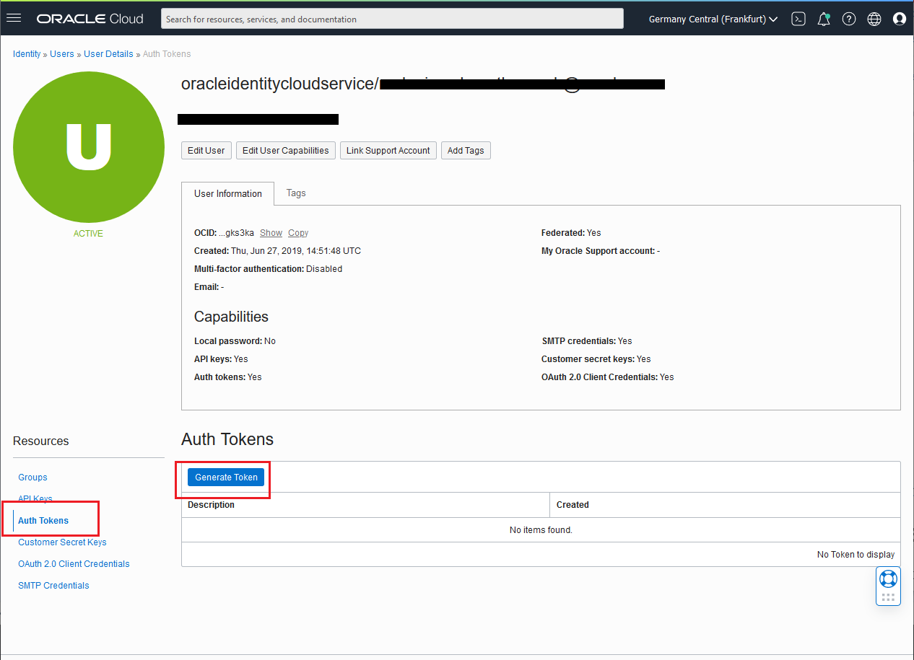

# Load the source data into Object Storage

## Introduction

In this lab we will create an object storage bucket in our compartment to upload the data that we will use during the rest of labs of this workshop.
Finally, we will create an Auth Token to allow access from the Autonomous Database to Object Storage.

**Estimated Lab Time:** 15 minutes.

### Objectives

In this lab, you will:

-   Create an object storage bucket
-   Upload data to your bucket
-   Generate an Auth Token

### Prerequisites

To complete this lab, you need to have the following:

- Logged into your Oracle Cloud Account

## **STEP 1**: Create an Object Storage Bucket

1. Go to **Menu** > **Storage** > **Object Storage & Archive** > **Buckets**.

   

2. Click **Create Bucket**. 
   
   Be sure you have select the same compartmebt ehere you have installed the Database in the previous lab. The default compartment is **root**, for the lab purpose you can use root.

   

3. Fill the **Create Bucket** form with the following values.

   - Bucket name: `lab-bucket`
   - Default Storage Tier: `Standard`
   - Encryption: `Encrypt using Oracle managed keys`

        

6. Click **Create**.

   You will now see the new bucket on your list of buckets

   

5. Your Object Storage bucket is ready to use.

## STEP 2: Populate your Object Storage Bucket

1. **Download** and **save** the following files to your local computer. 

   - [export_spatial22Sep2020.dmp](files/export_spatial22Sep202.dmp) 
   - [PurchaseOrders.dmp](files/PurchaseOrders.dmp)
   - [xmlfile.xml](files/xmlfile.xml)

2. **Open** your new bucket by clicking the name.
   

3. Select **Upload**.

   

4. In the **Upload Objects** dialog, click on **select files**.
   And finally, in the file browser, **select** the 3 downloaded files and click **Open**.

   

6. **Verify** you have the correct files listed, and then select **Upload**

   
   
7. The upload of the 3 files will start. Once the upload is complete you will see the status marked as **Finished** on the right hand side of the page. Select **Close**

   

8. Your bucket now **contains the 3 files required to run this workshop**. You will use these in the following lab sessions.

## STEP 3: Generate an Auth Token

To access data in the **Object Storage**, you must **enable** your database user to **authenticate itself** with the Object Storage using your object store account and authentication token. 

> Note: Once an Auth Token has been generated, it is only output to the screen once. As part of this step you will be asked to save the output into a text file for later use.

In this lab you will generate the **token as your user**, and it will inherit the same permissions and rights in Oracle Cloud as your user. 
In a production environment, you would normally want to create a new cloud user and assign the least privileges required to read the Object Storage bucket using policies in the cloud.

1. **Select** the profile icon in the top right hand corner of the screen. Then **click** on your username to go to your **User Details** page.

   

   
2. On the **User Details** screen select **Auth Tokens** in the left hand Resources section and then **Generate Token**.

   

3. **Enter** a description for your token e.g. `lab token` and select **Generate Token**.

   

4. The Token is generated. Select **Copy** and save the output to a text file called `token.txt` on your computer.

   

5. You can now select **Close**. You will see the **Auth Token** listed on the screen.
   

_At this point, you have done the data preparation steps for this lab, please proceed._

## **Acknowledgements**

- **Author** - Melanie Ashworth-March, Oracle Solution Center
- **Contributor** - Priscila Iruela, Victor Martin