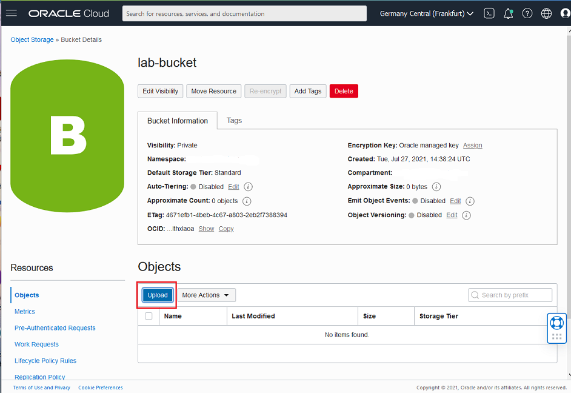
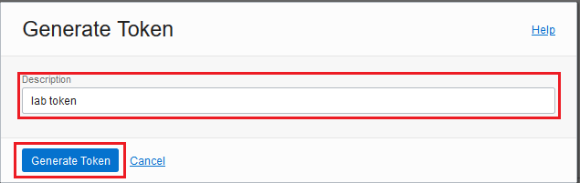
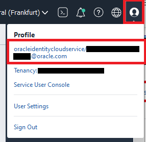
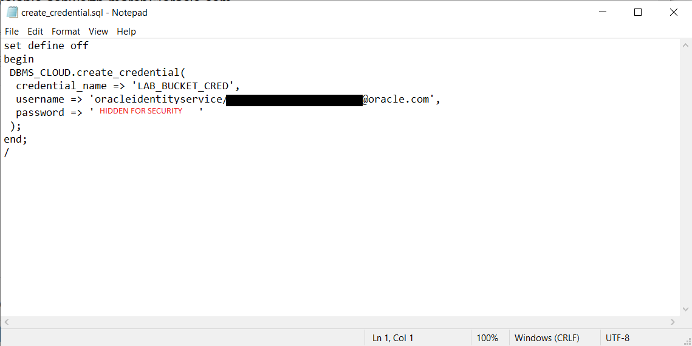

# Load the source data into Object Storage


## Introduction

This lab prepares the converged data sources required for the remaining labs.


_Estimated Lab Time:_ 15 minutes

### Objectives

In this lab, you will:

-   Create an object storage bucket
-   Upload data to your bucket
-   Generate an Auth Token to allow access from the Autonomous Database to object storage.

### Prerequisites

To complete this lab, you need to have the following:

- Logged into your Oracle Cloud Account

## **STEP 1**: Create an Object Storage Bucket

1. Go to **Menu** > **Storage** > **Object Storage & Archive** > **Buckets**.

   

2. Click **Create Bucket**. Be sure you have select the same compartment where you have installed the Database in the previous lab. The default compartment is **root**, for the lab purpose you can use root.

   

3. Fill the Create Bucket form with the following values.

   

      - Bucket name: `lab-bucket`
      - Default Storage Tier: `Standard`
      - Encryption: `Encrypt using Oracle managed keys`

        

6. Click **Create **

   You will now see the new bucket on your list of buckets

   

5. Your Object Storage bucket is ready to use.

## STEP 2: Populate your Object Storage Bucket

1. Download and save the following files to your local computer. 
   [export_spatial22Sep2020.dmp](files/export_spatial22Sep202.dmp) 

   [PurchaseOrders.dmp](files/PurchaseOrders.dmp)

   [xmlfile.xml](files/xmlfile.xml)

2. Open your new bucket by clicking the name.
   

3. Select **Upload**
   

   

4. In the *Upload Objects* dialog, click on **select files** .

5. In the file browser, select the 3 downloaded files and click open.
   

6. Verify you have the correct files listed, and then select **Upload**

   
   
7. The upload of the 3 files will start. Once the upload is complete you will see the status marked as *Finished* on the right hand side of the page. Select **Close**

   

8. Your bucket now contains the 3 files required to run this workshop. You will use these in the following lab sessions.


## STEP 3: Generate an Auth Token

To access data in  Object Storage you must enable your database user to authenticate itself with the Object Storage using your username and an authentication token. 

> Note: Once an Auth Token has been generated, it is only output to the screen once. As part of this step you will be asked to save the output into a text file for later use.

In this lab you will generate the token as your Oracle Cloud user, and it will inherit the same permissions and rights in Oracle Cloud as your user. In a production environment  you could create a new cloud user just for the purposes of accessing an object storage bucket and assign the least privileges required to read the specific Object Storage bucket using policies.

1. Select the profile icon in the top right hand corner of the screen.  Then click on your username to go to your User Details page
   
2. On the *User Details* screen select **Auth Tokens** in the left hand Resources section and then **Generate Token**.
   
3. Enter a description for your token e.g. `lab token` and select **Generate Token**.
   
4. The Token is generated. Select **Copy** and save the output to a text file called `token.txt` on your computer.
   
5. You can now select **Close**. You will see the Auth Token listed on the screen.
   


## STEP 4: Prepare the DBMS_CLOUD.CREATE_CREDENTIAL statement

During this lab you will create a private CREDENTIAL object for your schema. The DBMS_CLOUD package is used to create the credential in Autonomous Shared Database, and store  This encrypted connection information is only usable by your user schema, and remains stored in the database for future use (until the AUTH token is destroyed by the cloud user). 

Using a text editor on your local machine prepare the following SQL and name it `create_credential.sql`

```
set define off
begin
 DBMS_CLOUD.create_credential(
  credential_name => 'LAB_BUCKET_CRED',
  username => '',
  password => ''
 );
end;
/
```

You will need to add more information to this SQL

- **password:** populate this with the AUTH token you generated in STEP 3
- **username:**  Your cloud username to use in this command can be found in the Cloud console. Select the user profile button on the top right hand side and you will see your complete username. 



Your SQL will look similar to this example (please note - this screenshot contains dummy values and cannot be used for your lab)



Save this file as you will need it several times during the lab. 

_At this point, you have done the data preparation steps for this lab, please proceed._

## **Acknowledgements**

- **Author** - Melanie Ashworth-March, Oracle Solution Center
- **Contributor** - Priscila Iruela, Victor Martin