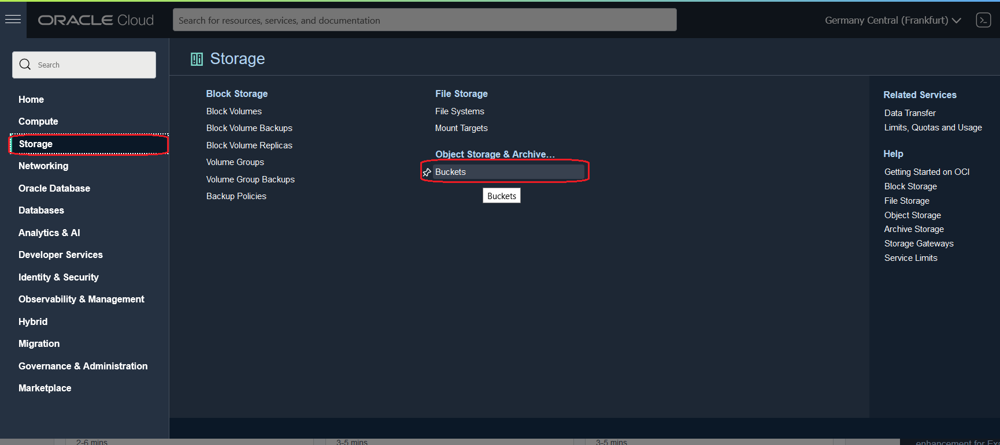
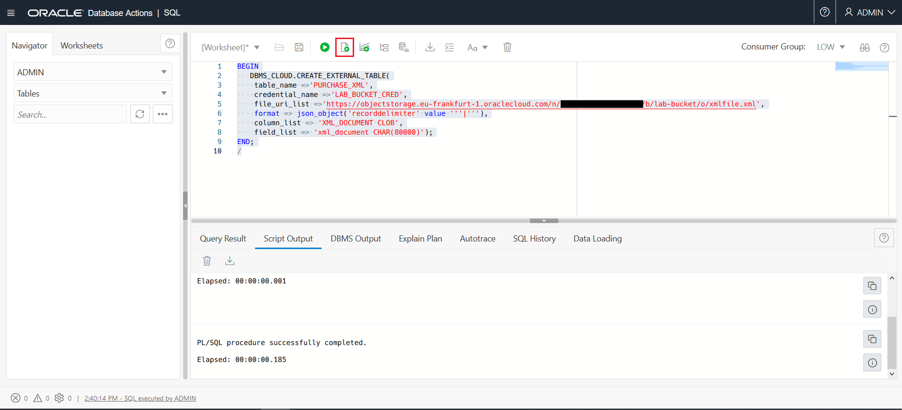
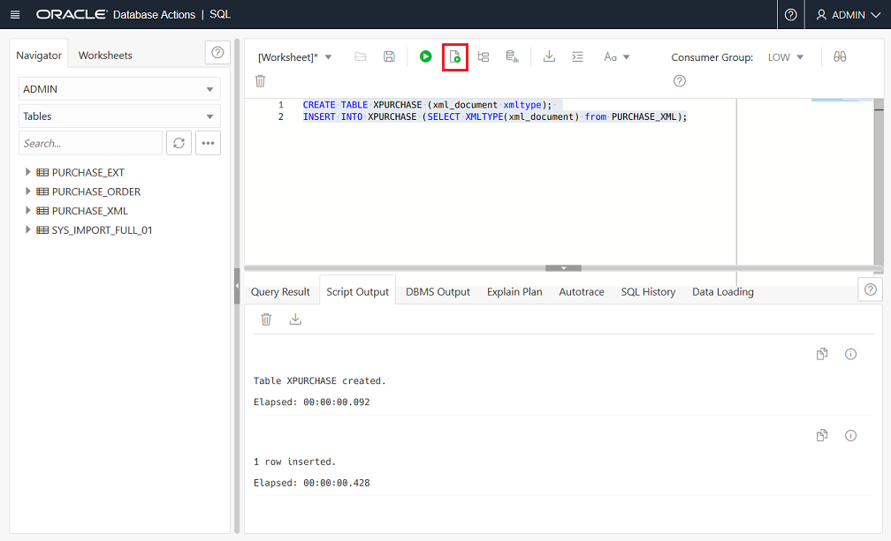

# Oracle XML and Autonomous Database

## Introduction

There are several steps within this lab.
-  Configure the environment  for the XML lab.
-  Query XML Data: XQuery is a very general and expressive language, and SQL/XML functions XMLQuery, XMLTable, XMLExists, and XMLCast combine that power of expression and computation with the strengths of SQL. We can query XMLType data, possibly decomposing the resulting XML into relational data using function XMLTable.
-  Insert and Update XML Data -  You can update XML content or replace either the entire contents of a document or only particular parts of a document. The ability to perform partial updates on XML documents is very powerful, particularly when we make small changes to large documents, as it can significantly reduce the amount of network traffic and disk input-output required to perform the update. The Oracle UPDATEXML function allows us to update XML content stored in Oracle Database.

## Objectives

### About Oracle XML

**XML (Extensible Markup Language)** is used to store and transport data. XML data is known as self-describing or self-defining, meaning that the structure of the data is embedded with the data, thus when the data arrives there is no need to pre-build the structure to store the data; it is dynamically understood within the XML.

The basic building block of an XML document is an element, defined by tags. An element has a beginning and an ending tag. All elements in an XML document are contained in an outermost element known as the root element. XML can also support nested elements, or elements within elements. This ability allows XML to support hierarchical structures. Element names describe the content of the element, and the structure describes the relationship between the elements.

For example, XML documents can be very simple, such as the following:

   

### XML with Oracle Database

**Oracle XML DB is a high-performance, native XML storage and retrieval technology that is delivered as a part of all versions of Oracle Database.**

Oracle XML DB also supports the SQL/XML standard, which allows SQL-centric development techniques to be used to publish XML directly from relational data stored in Oracle Database. XML is an extremely popular way to persist and exchange business critical information.

[](https://youtu.be/lGQvxPCYR2c)

Oracle XML DB allows an organization to manage XML content in the same way that ii manages traditional relational data. This allows organizations to save costs and improve return on investment by using a single platform to manage and secure all of their mission critical data. Oracle XML DB was first released with Oracle 9iR2, and it has been enhanced in each subsequent major release of the database.

There are some limitations on the usage of XML in Autonomous Database. See the documentation [here](https://docs.oracle.com/en/cloud/paas/autonomous-database/atpdg/experienced-database-users.html).

**Expected Lab Duration**: 30 minutes.

## TASK 1: Start SQL Developer Web

1. Open **Database Actions** from your **Database Details screen**.

   

2. **Enter** the username `admin` and select **Next.**

   

3. **Enter** the password for admin `Oracle_12345` and select **Sign In**.

   

4. Under the **Development** region of the **Database Actions** page select the **SQL** tile.

   


## TASK 2: Prepare your user to access Object Storage

1. During the section **Preparing the Data** on Load the source data into Object Storage Lab, you prepared a `create_credential.sql` file. **Copy and paste** the content of this into **SQL Developer Web** and **execute** using the **Run Script** button on the top of the page. 

  > Note: Do not copy and paste the example script below.

  

  You only need to create the credential once per schema during the lab. If you receive the error `ORA-20022: Credential "ADMIN"."LAB_BUCKET_CRED" already exists` then you have already created this credential as part of a previous step in this lab. 

## TASK 3: Create an External Table on the file

To create an **external table** using a file stored in Object Storage you will use the `DBMS_CLOUD.CREATE_EXTERNAL_TABLE` procedure.

1. **Locate** the file URI (URL Path) for your JSON files. Go to **Menu** > **Storage** > **Object Storage & Archive** > **Buckets**.

  

2. **Click** on the name of your **lab-bucket**.

  

3. On the **Bucket details** screen **Click** on the **Action menu** (the 3 dots menu) next to the file **xmlfile.xml**. Select **View Object Details**.
   
  

4. On the **Object Details** dialog note the value for the **URL Path (URI)**.

   

5. Use the **URI** from the previous step in this SQL, **replacing** the text `FILE_URL_HERE` with the URI from your tenancy. **Execute** this SQL using the **Run Script** button on the top of the page.

   ```sql
   BEGIN
      DBMS_CLOUD.CREATE_EXTERNAL_TABLE(
       table_name =>'PURCHASE_XML',
       credential_name =>'LAB_BUCKET_CRED',
       file_uri_list =>'YOUR-FILE-URI-HERE',
       format => json_object('recorddelimiter' value '''|'''),
       column_list => 'XML_DOCUMENT CLOB',
       field_list => 'xml_document CHAR(80000)');
   END;
   /
   ```

   The parameters you are providing are as follows:

   - **table\_name**: This will be the new table's name.

   - **credential\_name**: This is the credential that has access to the Object Storage location. This  credential and name was created as part of STEP 2 of this Lab.

   - **file\_uri\_list**: This is the file location. It can be specified in several formats see the [documentation](https://docs.oracle.com/en/cloud/paas/autonomous-database/adbsa/file-uri-formats.html) for details.

   - **format**: This describes the format for the data in the file. In this example you are specifying a rejectlimit, but you could also specify record separators and other information  depending on the format of your file. See the [documentation](https://docs.oracle.com/en/cloud/paas/autonomous-database/adbsa/format-options.html) for more details on the available formats.

   - **column\_list**: A comma-delimited list of column names and data types for the external table.

   

## TASK 4: Create a table from the External Table 

1. You can now immediately query our **XML file lying in the object store via the external table CLOB column**, using [native database XML features](https://docs.oracle.com/en/database/oracle/oracle-database/19/adxdb/how-to-use-XML-DB.html#GUID-D937B3D1-BA54-41D0-9428-4739DA805D75) such as XPATH expressions.

   ```sql
   SELECT EXTRACTVALUE(XMLTYPE(xml_document),'/PurchaseOrder/Actions/Action/User') 
   as Users 
   from PURCHASE_XML;
   ```
   

2. Use your **external table** to populate a table in the database.

   ```sql
   CREATE TABLE XPURCHASE (xml_document xmltype); 
   INSERT INTO XPURCHASE 
   (SELECT XMLTYPE(xml_document) from PURCHASE_XML);
   ```

   


## TASK 5: Insert an XML record

1. Let us take a **count** of the rows we have currently in the table in the database and then do a insert. The source external table had **1 row**.

   ```sql
   SELECT Count(*) FROM xpurchase p;
   ```

2. Download the SQL for the insert statement from [xml-insert.sql](files/xml-insert.sql). Copy and paste the full statement into **SQL Developer Web**.

   

   This should return 1 more row !
   
   ```sql
   SELECT Count(*) FROM xpurchase p;
   ```

## TASK 6: Update values in the XML table

You can update values in your XML data stored in the database.

1. **Review** which user is responsible for the the **Purchase Order** with the Reference **'MSD-20200505'**.

   ```sql
   SELECT extractValue(xml_document, '/PurchaseOrder/User') 
   FROM xpurchase where existsNode(xml_document, '/PurchaseOrder[Reference="MSD-20200505"]') =1;
   ```

   


2. **Update** the User to **'M March'**.

   ```sql
   UPDATE xpurchase
   set xml_document=updateXML(XML_DOCUMENT, '/PurchaseOrder/User/text()', 'M March')
   WHERE existsNode(XML_DOCUMENT, '/PurchaseOrder[Reference="MSD-20200505"]')=1;
   commit;
   ```

   

3. **Verify** that the update was successful.

   ```sql
   SELECT extractValue(xml_document, '/PurchaseOrder/User') 
   FROM xpurchase where existsNode(xml_document, '/PurchaseOrder[Reference="MSD-20200505"]') =1;
   ```

   

## TASK 7: Example Queries

1. Get the list of the customer and their purchase information from a specific geographical location.  

**XMLEXISTS** is an SQL/XML operator that you can use to query XML values in SQL, in a regular query. You can use the xmlexists function to look to see if a specific value is present in an xmltype column.

   ```sql
   SELECT xp.xml_document.getclobval() 
   FROM xpurchase xp
   WHERE xmlexists('/PurchaseOrder/ShippingInstructions/Address[city/text()=$CITY]' passing xml_document, 'South San Francisco' AS "CITY" );
   ```

   


2. Get the product description for products whose unit prices matches $19.95. **XMLSERIALIZE** is a SQL/XML operator that you can use to convert an XML type to a character type. **Download** the SQL for the statement from [xmlserialize.sql](files/xmlserialize.sql). **Copy and paste** the full statement into **SQL Developer Web**.

   

3. **XMLQUERY** allows you to query XML data in SQL statements. It takes an XQuery expression as a string literal, an optional context item, and other bind variables and returns the result of evaluating the XQuery expression using these input values. The XQuery string is a complete XQuery expression, including prolog (a series of declarations and definitions that together create the required environment for query processing). For more information about XQuery see the standard [here](https://www.w3.org/TR/xquery/).
Download the SQL for the  statement from [xmlquery.sql](files/xmlquery.sql). Copy and paste the full statement into SQL Developer.

   

4. Find the purchase order reference if the Special Instructions for the order are 'COD' (Cash on Delivery). **ExistsNode** checks if  the xpath-expression returns at least one XML element or text node. If so, `existsNode` returns 1, otherwise, it returns 0. `existsNode` should only be used in the where clause of the select statement.

   ```sql
   SELECT extractValue(XML_DOCUMENT, '/PurchaseOrder/Reference') "REFERENCE"
   FROM xpurchase WHERE existsNode(XML_DOCUMENT, '/PurchaseOrder[Special_Instructions="COD"]')=1;
   ```

   

_Congratulations, you have completed this lab on XML in Autonomous Database._

### Learn More
- [XML](https://docs.oracle.com/en/database/oracle/oracle-database/19/adxdb/index.html)

## Acknowledgements
- **Authors** - Balasubramanian Ramamoorthy, Arvind Bhope, Melanie Ashworth-March
- **Contributor**: Priscila Iruela, Victor Martin
- **Last Updated By/Date** - Melanie Ashworth-March / June 2021